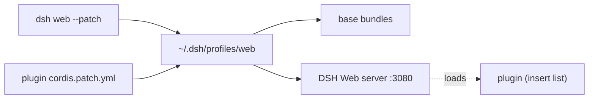

# dsh-plugins

English | [中文](./README.md)

A collection of native plugins for [DeepSeek Harness (DSH)](https://github.com/DeepSeekAI/deepseek-harness). Each plugin lives in its own directory and is loaded as a cordis plugin via `dsh web --patch`, without modifying the DSH core.

## Plugin list

| Plugin | Feature | Docs |
|--------|---------|------|
| [dsh-cron-loop](./dsh-cron-loop) | Project-level cron scheduled tasks: `/cron` command + `cron_job` tool + `http://127.0.0.1:3080/cron` task center | [README](./dsh-cron-loop/README.en.md) |

> When adding a plugin, append a row here and place a `README.md` inside the plugin directory.

## What is a DSH plugin

A DSH plugin is a cordis plugin overlaid onto the web profile via `dsh web --patch <file>`, without touching the DSH core. Plugins implement features through public Services (`webServer`/`agents`/`commands`/`timer`, etc.) + direct file IO.



## General installation

The repo root provides `run.sh` to manage plugin release and installation:

```bash
# Install a plugin into the DSH web profile
./run.sh <plugin> -i          # e.g. ./run.sh dsh-cron-loop -i

# Update to the current source version
./run.sh <plugin> -u

# Release: bump version + pack + push
./run.sh <plugin> -r patch    # bump patch
./run.sh <plugin> -r          # pack with current version (no bump)
./run.sh <plugin> -r patch -u # release then update
./run.sh <plugin> -r minor -t # release minor and create a git tag
```

> Artifact path: `<plugin>/.dist/<name>-<version>.tgz`

### Manual install (without run.sh)

1. Ensure DSH is installed (`npm i -g @deepseek-ai/dsh` or npx), pnpm ≥ 10, and Node.js ≥ 22.
2. Clone this repo: `git clone https://github.com/CaffeineOddity/dsh-plugins.git`
3. Enter the target plugin dir and install deps: `cd dsh-<name> && pnpm install`
4. Add the plugin as a bundle: `dsh plugin --profile web add link:$(pwd)`
5. Start: `dsh web`

See each plugin's `README.md` for specific usage.

## Conventions

- Each plugin is a standalone directory with its own `package.json` / `tsconfig.json` / `cordis.patch.yml`.
- Design specs live in `specs/`, following SDD (the spec is the single source of truth for requirements).
- The main README covers only feature summary + install/usage; development details link to spec/docs via relative paths.
- Bilingual: Chinese `README.md` is primary, English `README.en.md` mirrors it, cross-linked at the top.

## License

MIT
