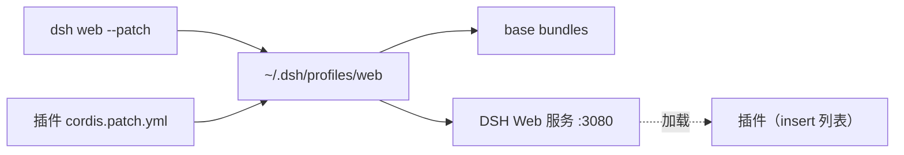

# dsh-plugins

[English](./README.en.md) | 中文

[DeepSeek Harness (DSH)](https://github.com/DeepSeekAI/deepseek-harness) 原生插件集合。每个插件是一个独立目录，通过 `dsh web --patch` 以 cordis 插件形式加载，不修改 DSH 本体。

## 插件列表

| 插件 | 功能 | 文档 |
|------|------|------|
| [dsh-cron-loop](./dsh-cron-loop) | 项目级 cron 定时任务：`/cron` 命令 + `cron_job` 工具 + `http://127.0.0.1:3080/cron` 任务中心 | [README](./dsh-cron-loop/README.md) |

> 新增插件时在此表格追加一行，并在插件目录内放置 `README.md`。

## 什么是 DSH 插件

DSH 插件是 cordis 插件，通过 `dsh web --patch <file>` 叠加到 web profile 上，不侵入 DSH 核心。插件用公开 Service（`webServer`/`agents`/`commands`/`timer` 等）+ 直接文件 IO 实现能力。



## 通用安装方式

仓库根目录提供 `run.sh` 统一管理插件的发布与安装：

```bash
# 首次安装插件到 DSH web profile
./run.sh <plugin> -i          # 例: ./run.sh dsh-cron-loop -i

# 更新到当前源码版本
./run.sh <plugin> -u

# 发布：bump 版本 + 打包 + 推送
./run.sh <plugin> -r patch    # bump patch
./run.sh <plugin> -r          # 用当前版本打包（不 bump）
./run.sh <plugin> -r patch -u # 发布后自动更新
./run.sh <plugin> -r minor -t # 发布 minor 并打 git tag
```

> 产物路径：`<plugin>/.dist/<name>-<version>.tgz`

### 手动安装（不用 run.sh）

1. 确保已安装 DSH（`npm i -g @deepseek-ai/dsh` 或 npx）与 pnpm ≥ 10、Node.js ≥ 22。
2. 克隆本仓库：`git clone https://github.com/CaffeineOddity/dsh-plugins.git`
3. 进入目标插件目录安装依赖：`cd dsh-<name> && pnpm install`
4. 把插件作为 bundle 安装进 web profile：`dsh plugin --profile web add link:$(pwd)`
5. 启动：`dsh web`

各插件的具体用法见其目录内的 `README.md`。

## 约定

- 每个插件独立目录，自含 `package.json` / `tsconfig.json` / `cordis.patch.yml`。
- 设计 spec 放 `specs/`，遵循 SDD（spec 是需求单一事实来源）。
- 主 README 只写功能简介 + 安装使用；开发细节用相对链接指向 spec/docs。
- 双语：中文 `README.md` 为主，英文 `README.en.md` 同步，顶部互链。

## License

MIT
