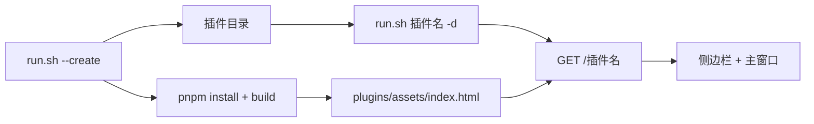

# run.sh --create 插件脚手架

## 目标

`./run.sh --create <插件名>` 在仓库根目录生成一个可被现有 `run.sh` 开发 / 发布 / 安装的 DSH 插件。页面用 React、Tailwind、Radix（仓库 `ui/` 的 shadcn 组件）。默认布局是侧边栏 + 主窗口。

## 范围

- 入口只有 `./run.sh --create <插件名>`，可选 `--no-install`（只写文件，不安装依赖、不构建）。
- 不自动 `dsh plugin add`，不重启 web。接入仍走现有 `./run.sh <插件名> -d|-i|-u|release`。
- 不改已有插件的发布 / 安装语义。
- 不把新插件自动写进根 README 插件表。

## 命令

```bash
./run.sh --create <插件名> [--no-install]
./run.sh <插件名> -d          # 生成后的插件可直接走原流程
```

插件名：小写字母开头，仅含小写字母、数字、连字符，长度 1–64，不能是路径。保留名：`ui`、`docs`、`scripts`、`templates`、`output`。目录已存在则失败并退出，不覆盖。

## 生成结果



- 包名、目录名、Cordis `id`、页面路径都是插件名。页面：`http://127.0.0.1:3080/<插件名>`。
- `cordis.patch.yml` 的 `name` 为 `./plugins/web.ts`，以便 `run.sh` 发布时改写成 `./dist/web.js`。注释里不要再写这条路径，发布替换是全局的。
- 有 `typecheck` 与 `build`。`build` 产出单文件 HTML 到 `plugins/assets/index.html`，并把 `plugins/` 编译到 `dist/`（含 `dist/assets`）。
- 宿主只依赖 `webServer`。页面每次请求重读 HTML，并带 `cache-control: no-cache`。
- 默认构建依赖仓库根 `ui/`。打进 tarball 的是已内联的 HTML，运行时不再需要 `ui/`。

## 界面

- 宽于 640px：固定侧边栏 + 主窗口。640px 及以下：主窗口优先，用 Radix Dialog 打开同一组导航。导航点击区至少 44px。
- 默认两页：概览（读 `/<插件名>/api/health`）、设置（Radix Switch + Input，保存在本机 `localStorage`）。
- 文案用动词，错误写明原因和下一步。跟随系统明暗色，色值只用 `ui/` 的语义 token。

## 验收

- `./run.sh -h` 含 `--create`；无插件名、非法名、目录已存在均非零退出且不写文件。
- `./run.sh <已有插件>` 无操作时行为与改前相同（打印用法，不创建）。
- 生成目录含 `package.json`、`cordis.patch.yml`、`plugins/web.ts`、`web/`，且无未替换的 `__PLUGIN_`。
- 默认创建会安装依赖并构建；`./run.sh <插件名> release` 能 typecheck + pack（不要求本 spec 自动跑发布）。
- `--no-install` 只写源码。

## 边界

- 不生成命令、工具、定时任务。业务页由插件作者加在 `web/src/pages`。
- 改 `plugins/*.ts` 后需重启 dsh web；只改页面并重新 `pnpm run build` 后刷新即可。
- 未构建时页面返回 500，正文说明要执行 `pnpm run build`。
