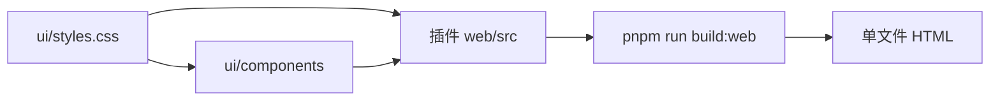

# 共享界面

## 目标

按钮、输入框、下拉等控件只维护一套密度。所有插件页面 import 仓库根 `ui/styles.css`，并使用 `ui/components`，不在插件里再写高度和边框。

## 约定

- 控件高 32px，字号 13px，圆角 6px，1px 描边，无投影。类名是 `.control` / `.control-field` / `.control-area`，定义在 `ui/styles.css`。
- 改密度只改这一处，然后重新构建各插件的 `web`。页面 HTML 是构建快照，不构建则仍是旧样式。
- 插件自己的导航行与表单行对齐这套高度，不另起 44px 点击区。

