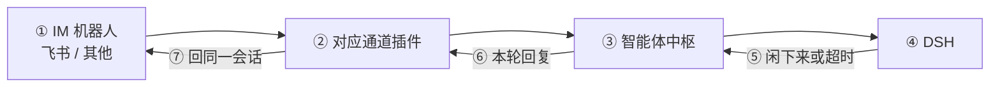
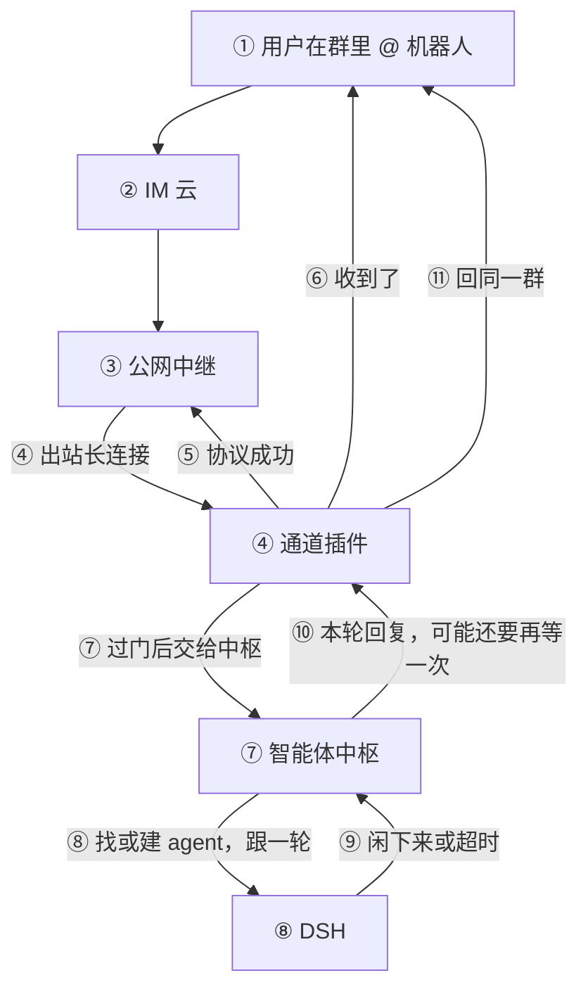
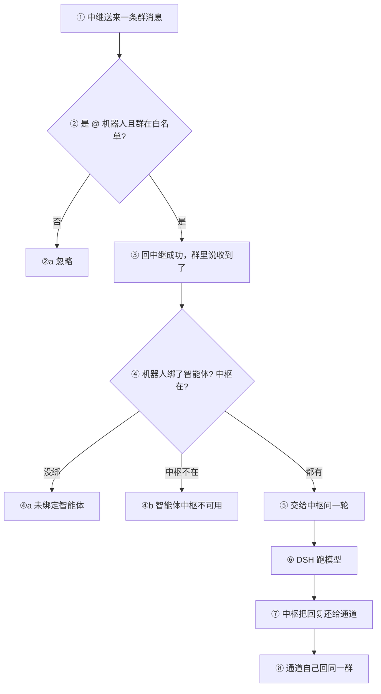
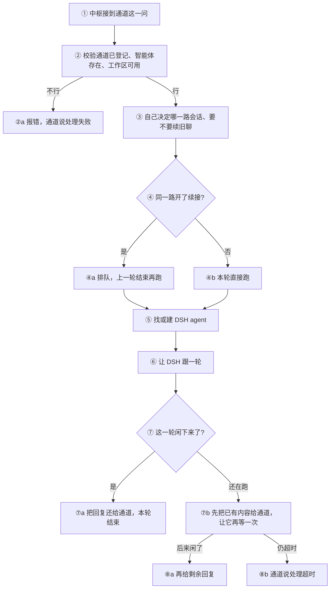

# 智能体中枢架构（当前）

`@oddity/dsh-agent-bot` 是大脑：管 skills / prompts / agents，跑 DSH agent 会话。它不碰任何 IM 的网，不持有 webhook，也不代发消息。每种 IM 是独立的通道插件（Provider）：飞书或其他 IM 各做一个插件即可，中枢不用改。契约见 [01](./specs/01-overview.md) 起各 spec。

## 主流程：机器人 -> 通道插件 -> 中枢 -> DSH

① 是某家 IM 的机器人（飞书或其他）。
② 是对应的通道插件，只做该 IM 的收发和账号/群管理。
③④ 起中枢和 DSH 对所有通道都一样。

下面细链路以飞书为例；其它 IM 把「中继 / webhook」换成它自己的收发即可。

---

以飞书为例：

① 用户在 IM 群里 @ 机器人。  
② IM 云把消息送到公网中继。  
③④ 中继通过本机那条出站长连接交给通道插件。  
⑤ 通道协议上马上回中继成功。  
⑥ 同时往群里回一句「收到了」。  
⑦ 过了门，把「哪个智能体、用户说了什么、哪台机器人、哪个群、谁发的」交给中枢。  
⑧⑨ 中枢找或建 DSH agent，让 DSH 跟一轮，等到闲下来或超时。  
⑩ 中枢把本轮回复还给通道，可能还要再等一次。  
⑪ 通道自己回同一群。

通道在 ④～⑦ 之间还要做自己的事：验签、解密、确认是在 @ 机器人、群在白名单里；再看这个机器人有没有绑智能体、中枢在不在。没绑就回「未绑定智能体」，中枢不在就回「智能体中枢不可用」，这两种都不再往下走。

过了门，通道把叶子数据交给中枢，同进程直接问，不拼会话号，也不把 webhook 传过去。

中枢校验通道已登记、智能体存在、工作区可用，自己决定这是哪一路会话、要不要续旧聊。同一路且开了续接就排队，一轮结束才放下一路。然后找或建 DSH 里的那个 agent：还活着就接着用，磁盘上有就恢复，没有就新建。工作区用这个智能体自己的目录。

真正跑模型的是 DSH：中枢对它跟一轮，等到这一轮闲下来，或等到超时。闲下来了，把本轮回复还给通道；还没闲完，先把已有内容给出去，并让通道再等一次。超时仍没结束，通道去说「处理超时」。中枢自己报错，通道只回「处理失败」，细节留在日志。

通道拿到结果后自己回同一会话：有内容就一条一条发；没有内容就说「本轮没有生成内容」；还在等的就等完再发或报超时。中枢不碰 IM 的网，也不代发。

整条链路就是：① IM 机器人（飞书 / 其他）-> ② 对应通道插件（收、过滤、ack、回发）-> ③ 智能体中枢（会话、排队、准备 agent）-> ④ DSH（真正跑模型）。新增 IM 只加通道插件，不改中枢。

主动推群（巡检、告警）不走这条链路，仍由智能体里该通道的 skill 自己发。

## 中枢自己做什么

通道登记进来时，中枢只记下通道名字，不收发送函数。运行时入口只有「问一轮」。要不要新开会话、要不要按人隔离，只看该智能体自己的配置，通道不能传会话号或重置标记。

同一智能体、同一会话槽，开了续接就排队；关掉续接则每轮新开，不排队。新建会话时挂标准预设、按该智能体的 `prompt_placement` 注入 prompt（系统提示词或接到用户对话后）；`prompt_append_skills` 打开时把 `skill_groups` 展开的技能名追加进文本。并写满权限，否则技能里的命令会被审批拦住。改 prompt、注入位置、技能组或该开关后下次提问因指纹不一致开新会话，不改已有 live 上的 section。本轮收口时记下上次提问时间和当前指纹，重启后仍按真实空闲计算。会话挂进 DSH workspace 时，侧边栏标题写成 `agent_<智能体名>`。插件卸掉时释放它创建或恢复过的全部 live agent。

v1 中枢只产出一条 markdown。ack、失败、超时、空回复都是通道自己的固定文案，不进中枢返回的内容列表。

## 配置与配置站

配置在本机 `~/.dsh/storages/agentbot`（可用环境变量改目录）：一份手改的配置，一份扫描出来的技能表。缺文件时给内存默认值、不落盘。中枢不读通道旧配置当主存储。

每个智能体独占一个工作区，保存时若和别的智能体撞目录会报错。技能组是一份列表，不按工具拆；保存列表本身不打软链，要应用到某个工具目录时才重建本插件建过的链。

设置页「智能体中枢」只打开独立配置页：技能、预设、智能体、全局超时、日志。不在这里配通道 token 或飞书 app。各通道设置页用中枢的智能体列表做下拉，把选中的智能体 id 写在自己的机器人 / 应用上。
