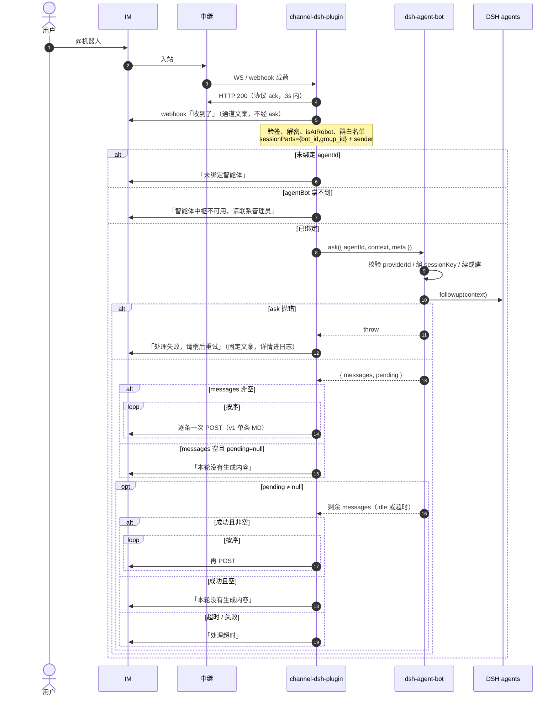
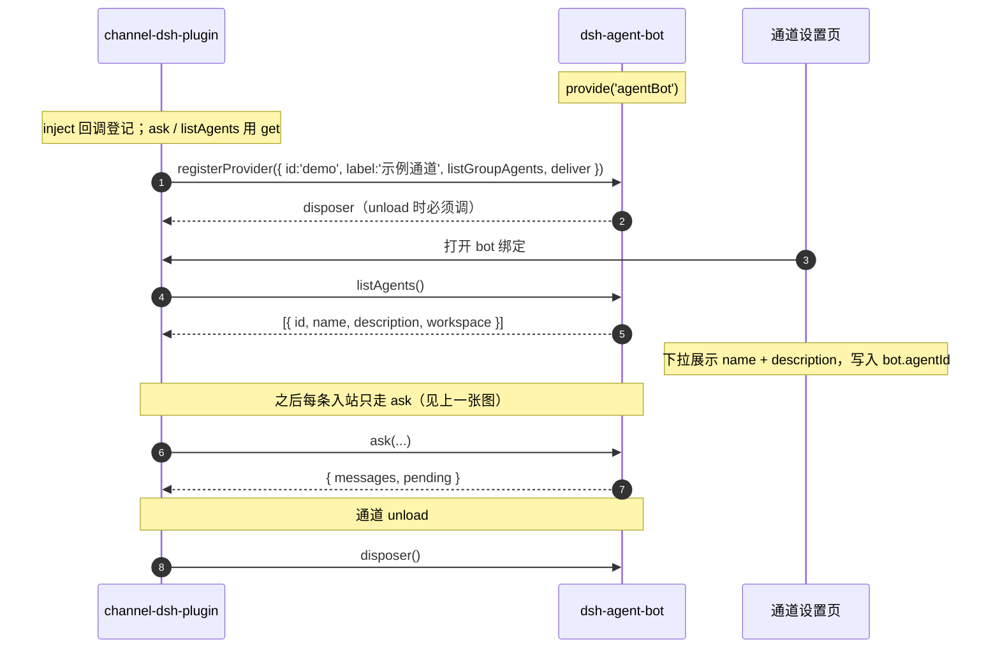

# 1. 智能体中枢总览

DSH 智能体中枢（`@oddity/dsh-agent-bot`）：管 skills / prompts / agents，跑 DSH agent 会话。
飞书等各自是独立 **Provider 插件**，只做该 IM 的收发与账号/群管理。

## 目标

- 一个 agent 可被多个 Provider 同时使用（多个 IM 群共用 workspace / skills / prompt）。
- 新增 IM = 新插件实现 Provider 契约，不改本插件。
- 本插件公开面不含 webhook / toid；通道不决定是否新开会话、是否按人隔离。

## 分层

```
Provider 插件（feishu / …）
  收：验签、过滤、ack 协议、组 context + sessionParts map
  问：ctx.get('agentBot').ask({ agentId, context, meta })
  发：await 回复后用自己的 API 投递（webhook 用 bot_id 在通道内解析）
        │
        ▼
agent-bot（本插件）
  校验 providerId 已注册
  按 agent.session_by_sender 决定是否把 sender 并入 parts，再 encodeSessionKey → sessions
  注入 context，返回 messages[] + pending（有序出站条，不是单字符串）
```

服务名：`agentBot`（`ctx.provide`）。本插件不 `inject` 任何通道服务。进程内同 Host，无 HTTP；唯一运行时入口是 `ask`。通道接入：`inject` 回调只用于 `registerProvider`；`ask` / `listAgents` 当时 `ctx.get('agentBot')`，拿不到就发固定文案（见 [2. 接入](./02-provider-contract.md)）。不要硬 `inject: ['agentBot']`。

## 一轮入站时序

一次用户 @（飞书为例；其它 IM 把「中继 / webhook」换成该 IM 的收发即可）：



ack、失败、超时、空回复都是通道自己的 send，不进 `messages`。v1 `messages` 固定单条 markdown；先图后文/多条为 v2（契约保留，届时多条逐次 POST）。通道侧细节见 [10. 消息转发原理](./10-message-relay.md)。

## 两插件通讯

同一 DSH 进程，Cordis 服务发现。**没有** npm 依赖。反向能力只有登记在 Provider 上的可选函数（`listGroupAgents` / `deliver`），大脑不持 webhook。



约束：

- 通道 → 大脑：`registerProvider` / `listAgents` / `getAgent` / `ask`。
- 大脑 → 通道：不持 webhook；本轮出站仍是 ask 返回值。任务收口走可选 `deliver({ sessionParts, messages })`（见 [12](./12-leader-experts-teamwork.md)）。
- 非本轮、非任务的主动推（告警）走 agent 的通道 skill，不经 `agentBot`。

## 插件形态

打包型 bundle：Host `dist/index.js` + Client `dist/client.js` + `cordis.patch.yml`（行 id `agent-bot`）。
配置目录：`env:AGENT_BOT_CONFIG_DIR`，缺省 `~/.dsh/storages/agentbot`（`config.json` 与 `skills-map.json` 直接放该目录，不再套一层 `config/`）。任务看板在同根下 `jobs/{todo|running|done}/task_xxx.md`，见 [12](./12-leader-experts-teamwork.md)。

源码布局：[11. MVVM](./11-mvvm-layout.md)。当前实现总览：[architecture.md](../architecture.md)。

## 阅读顺序

1. 本文
2. [通道 Provider 契约](./02-provider-contract.md)
3. [ask 与会话续接](./03-ask-and-session.md)
4. [配置数据模型](./04-config-model.md)
5. [Skills Tab](./05-skills.md)
6. [Prompts Tab](./06-prompts.md)
7. [Agents Tab](./07-agent-tab.md)
8. [配置站](./08-config-site.md)
9. [消息转发原理](./10-message-relay.md)
10. [MVVM 源码布局](./11-mvvm-layout.md)
11. [Leader 与专家协作](./12-leader-experts-teamwork.md)（[流程用例](./12-leader-experts-teamwork-cases.md)）

## 不做项

- 不 npm 依赖 `@oddity/dsh-channel-bot` 或任何 IM 插件。
- 不持有通道 webhook / 裸 send 函数。收口只经 Provider `deliver`。
- 不在本插件实现通道验签/中继/群管理。
- 不与其它「大脑」同时消费同一条入站（通道只调一个 `agentId`）。
