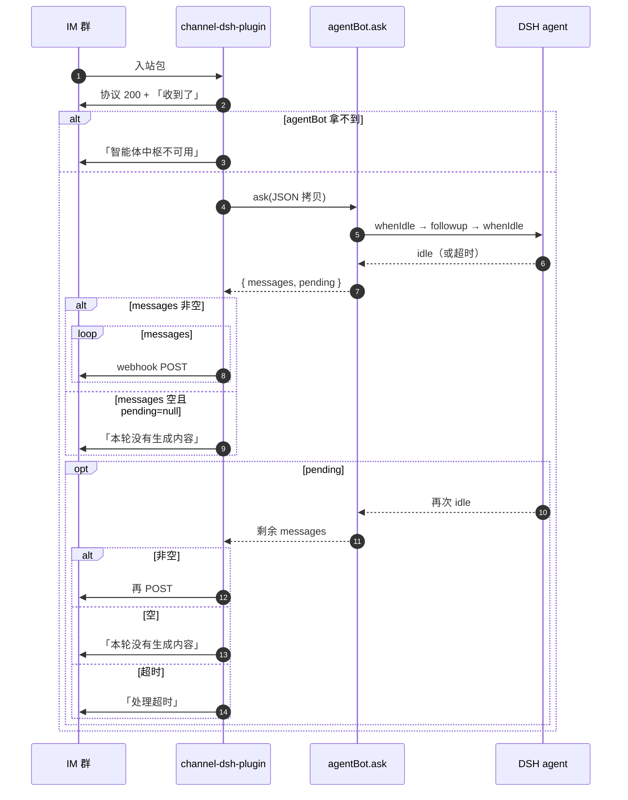

# 10. 消息转发原理（通道 ↔ agent-bot）

两个插件跑在 **同一个 DSH / Cordis 进程**。IM 消息进大脑、结果回 IM，是通道拿到 `agentBot` 服务后的 **直接函数调用**。

契约字段见 [2. 通道 Provider 契约](./02-provider-contract.md)；会话怎么划见 [3. ask 与会话续接](./03-ask-and-session.md)。本文只讲 **实现原理：字节怎么走**。

## 总线

```
IM 云 ──中继 WS──► channel-dsh-plugin ──ctx.get('agentBot').ask()──► dsh-agent-bot
                         │                                              │
                         │   返回 { messages, pending }                  │
                         │◄─────────────────────────────────────────────┘
                         │
                         └──webhook POST──► 同一 IM 群
```

| 段 | 传输 | 内容 |
|---|---|---|
| IM → 中继 → 通道 | 网络（现有中继） | 加密入站包 |
| 通道 → agent-bot | 同进程调用 | 纯 JSON：`agentId` + `context` + `meta` |
| agent-bot → DSH agent | 同进程 `followup` | 用户文本 |
| agent-bot → 通道 | 函数返回值 | `messages[]` + 可选 `pending` Promise |
| 通道 → IM 群 | 网络 webhook | TEXT / MD / IMAGE，一条消息一次 POST |

没有插件之间的 HTTP / RPC / 文件管道，大脑也不持有 webhook 或 send 回调。

`pending` 是 **同进程 Promise**，禁止 `JSON.stringify`，因为它过不了进程边界。

## 服务怎么接上

启动顺序（Host 半体），登记与调用分开（见 [2. 接入](./02-provider-contract.md)）：

1. `dsh-agent-bot` `provide('agentBot', service)`。
2. **登记**：`channel-dsh-plugin` 用 `ctx.inject(['agentBot'], cb)` 回调 `registerProvider({ id: 'demo', label: '示例通道' })`。大脑热重载后回调重跑，自动重注册。unload 调返回的 disposer（带代数，覆盖后 no-op）。
3. **ask / listAgents**：当时 `ctx.get('agentBot')`。拿不到 → 通道发「智能体中枢不可用，请联系管理员」，不静默丢弃。**不要**写硬 `inject: ['agentBot']`。

通道 **duck-type** [src/types.ts](../../src/types.ts)，不 npm 依赖 `@oddity/dsh-agent-bot`。设置页绑 agent 时再 `listAgents()`，只读 `id/name/description`，写入本插件 **bot 级** `agentId`。

## 入站：IM → agent-bot

通道做完验签、解密、`isAtRobot`、群白名单、协议 200、用户可见「收到了」之后，**拷一份叶子数据**再 ask（不要把 Cordis/Session/webhook 对象丢进去）：

```
ask({
  agentId,                    // bot 上绑的智能体（每 bot 一个）
  context,                    // 唯一格式：用户[<fromuserid>]: <纯文本>
  meta: {
    traceId,                  // 本轮日志
    providerId: 'demo',
    sessionParts: { bot_id, group_id },
    sender,                   // message.header.fromuserid
  },
})
```

**不转发**：webhook URL、toid、中继包、加密密钥、IM message id、prompt、成员档案。回发坐标留在通道自己的闭包（`bot_id` → webhook，`group_id` → toid）。

## 大脑：ask 内部

回合模型搬家到 agent-bot：

```
ensureAgent(sessionId)
await whenIdle()              // 上一轮必须先闲（队列 gate）
firstSeq = session.seq
followup(user message)
race(whenIdle(), timeout)     // idle = 本轮 DSH loop 结束；从 followup 实际开始起算
同步截取 [firstSeq, 现在]      // 截完才放行队列里的下一轮
return { messages, pending }
```

「一轮结束」= 这次 `followup` 对应的 agent loop 回到 idle（或安全阀超时）。

超时且还没正文：`messages` 可空，`pending = 第二次 race(whenIdle(), agent_wait_timeout_ms)`——第二段等待同样用 `agent_wait_timeout_ms`，到点 reject（总上限 2× 配置值），不存在永不 settle 的 pending。同一 `(agentId, sessionKey)` 且 `reuse_session: true` 时走 **串行队列**（FIFO、不设上限、超时只计自己那轮）；并行靠 `session_by_sender` / `reuse_session: false` 配置开关。本轮收口时把 `lastAskAt` 写回 `sessions[key]` 并落盘。

## `messages` 不是一直 pending

`ask` 立刻返回的是一个对象，里面两块互相独立：

| 字段 | 含义 |
|---|---|
| `messages` | **现在就能发**的条（可能是 `[]`） |
| `pending` | `null` = 本轮已收口，通道不必再等；非 `null` = 还在跑，settle 后再发剩余条 |

**告诉通道「结束了」的信号就是 `pending === null`**（或 `pending` 这个 Promise 已经 fulfill/reject）。

对应 DSH：

1. `whenIdle` 在超时前到：本轮 loop 结束 → `messages` = 本轮条，`pending = null`。`messages` 非空则发完即结束；**空则发「本轮没有生成内容」**。不必再问大脑。
2. 先超时、`whenIdle` 还没到：`messages` 里若已有字就先发；`pending = 第二次 race(whenIdle(), agent_wait_timeout_ms)`。idle 之后 `pending` resolve，通道再发剩余条——**这时才算结束**。
3. `pending` reject（安全阀到点）：通道发「处理超时」，本轮也结束。
4. `pending` resolve 空（正常收尾但无输出）：通道发「本轮没有生成内容」。

常见路径是 1：大多数回合 `pending` 直接是 `null`，并不是每条消息都挂着 pending。

```
const bot = ctx.get('agentBot')
if (bot === undefined) {
  await sendText('智能体中枢不可用，请联系管理员')
  return
}
const { messages, pending } = await bot.ask(...)
if (messages.length > 0) await sendAll(messages)
else if (pending === null) await sendText('本轮没有生成内容')
if (pending !== null) {
  const rest = await pending   // 第二次 race(whenIdle(), agent_wait_timeout_ms)
  if (rest.length === 0) await sendText('本轮没有生成内容')
  else await sendAll(rest)
}
```

## 出站：agent-bot → IM

通道拿到返回值后 **自己** webhook POST，大脑不碰网。实现与上一节同一段：`await pending`（不要 fire-and-forget `.then`），空 `messages` + `pending=null` 也发「本轮没有生成内容」。`ask` 抛错：通道发固定文案「处理失败，请稍后重试」；错误详情与 traceId 只进日志。

`sendOne`：用闭包里的 `bot_id` 查 webhook、`group_id` 当数字 toid。

v1 常态：

```
messages = [ { kind: 'markdown', text: '…', url: '', atUserIds: [], atAll: false } ]
→ 单条 MD POST。
```

通道已实现、大脑 v1 不产（出站收集器届时另立 spec）：

```
messages = [
  { kind: 'image', text: '', url: '/abs/a.png', atUserIds: [], atAll: false },
  { kind: 'markdown', text: '说明', url: '', atUserIds: [], atAll: false },
]
→ POST IMAGE（content=文件 base64），再 POST MD。

{ kind: 'link', text: '文档', url: 'https://example.com', atUserIds: [], atAll: false }
→ POST LINK。

{ kind: 'text', text: '请看', url: '', atUserIds: ['alice'], atAll: false }
→ POST TEXT + AT。
```

## 时序（实现视角）



对照 [1. 总览](./01-overview.md) 的两张图：上一张是用户可见时序，本图是调用栈。

## ask 调用会结束；会话可以留下

每一次 @ 都是一次 **新的 `ask()`**。这次调用在 `messages` 投完、且 `pending` 敲定（成功补发或失败）之后就结束，通道不把这条 ask 挂着当长连接。

活着的是 **DSH agent 会话**，不是 ask：

| 对象 | 一轮结束后 |
|---|---|
| 这次 `ask()` 调用栈 / `pending` | 结束，可 GC |
| 通道里本轮的 `traceId`、闭包里的 webhook 坐标 | 用完即丢（不必为下一轮留 ask 通道） |
| `agents[].sessions[sessionKey]` | 仍指向同一个 DSH `sessionId` |
| 进程内 live `Agent` handle | 按续接策略留着，供下次 `followup` |

下一轮同一群再 @：通道再调一次 `ask`，大脑用同一套 `sessionParts`（+ 可选 sender）编出同一 `sessionKey`，找到旧 uuid，`followup` 续聊。不是把上一轮 ask 管道复开。

何时不续、改新建：该 agent 的 `reuse_session` / `session_timeout_minutes` / 配置站清槽 / 会话已归档。见 [3. 续接策略](./03-ask-and-session.md)。

插件 `registerProvider` 的登记随通道进程在，和单轮 ask 无关。

## 不做项

- 不在两插件间再加 RPC / websocket。
- 不把 live `Agent` / `Session` / webhook 函数传入 ask。
- 不让 agent-bot 调 `sendGroupMessage` 或持有 webhook。
- 告警等非本轮、非任务的主动推仍走 channel skill，不经 `ask`。
- 任务收口：通道在 `registerProvider` 提供 `deliver({ sessionParts, messages })`，与本轮回发同一套 `sendOne`。不走入站 FIFO，不复用原 ask 的 `pending`。见 [12](./12-leader-experts-teamwork.md)。
