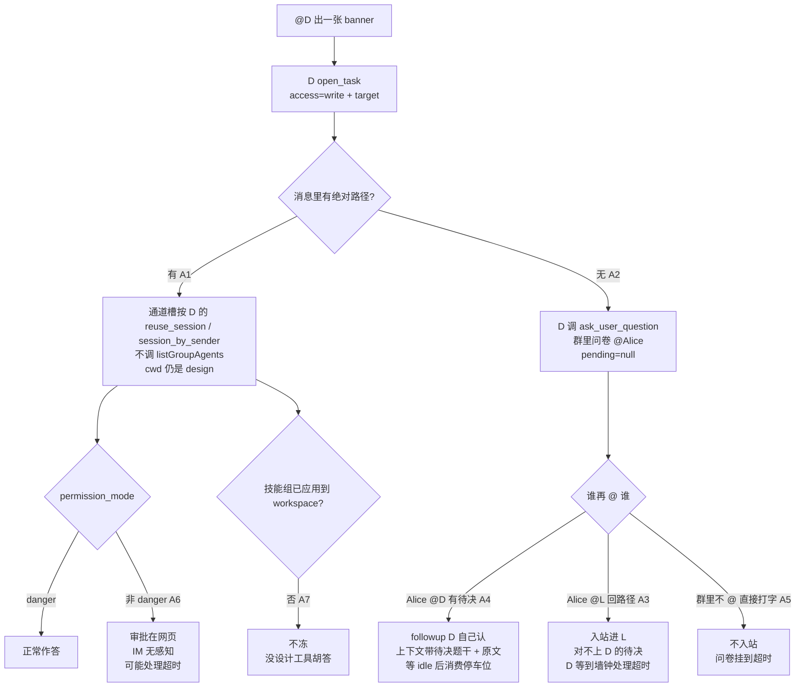
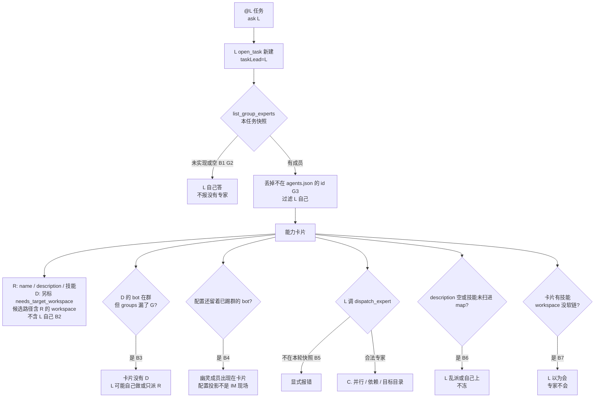
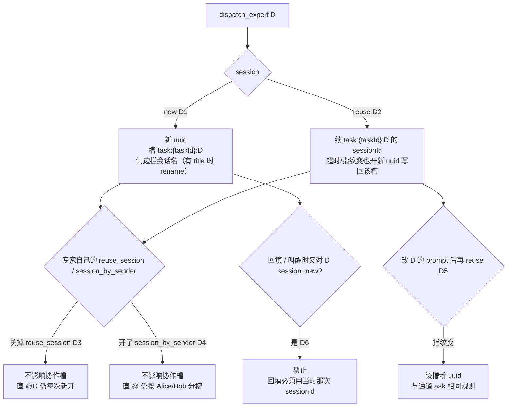
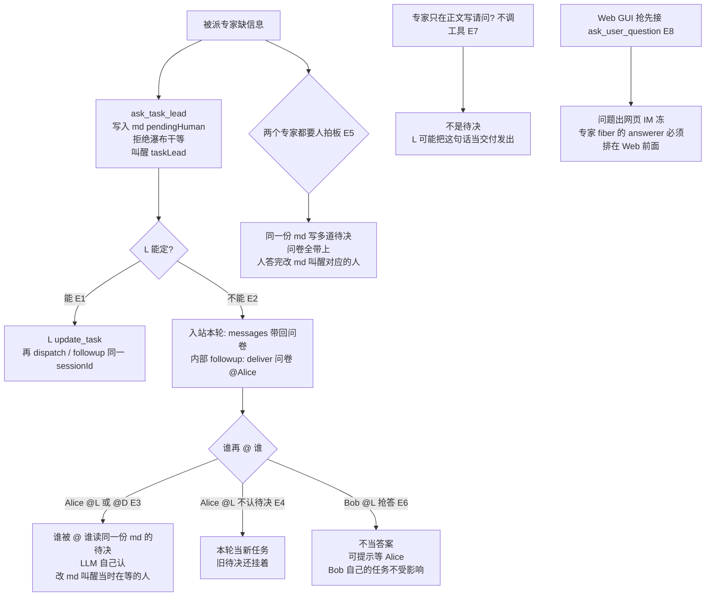
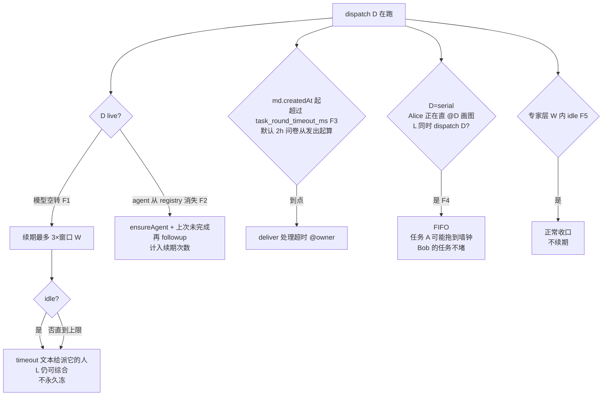
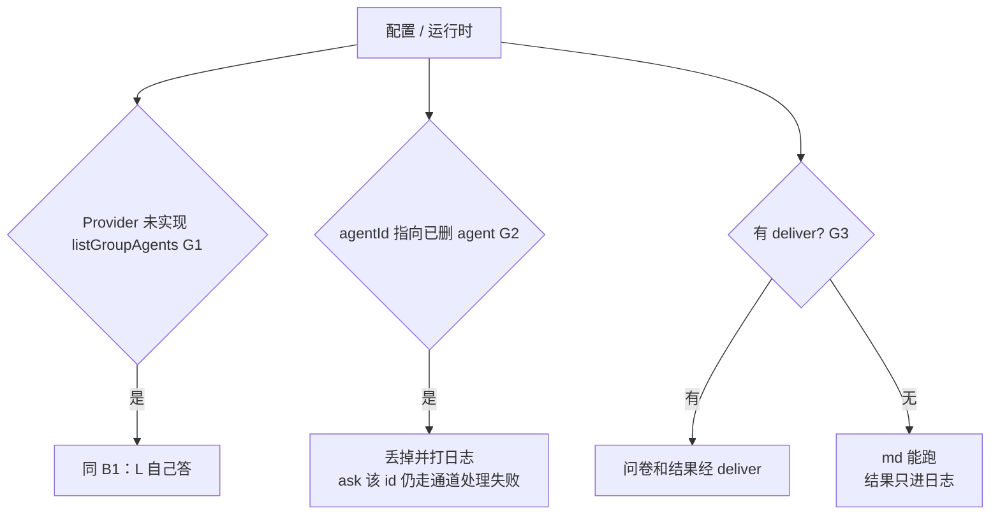
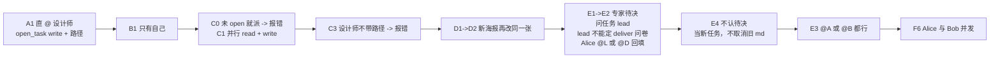

# 12-cases. 群内专家协作流程用例

对照 [12](./12-leader-experts-teamwork.md) 跟踪流程。每条写：**入口 -> 期望 -> 失败时**。不是测试脚本，实现时按编号核对。

**没有专职 lead。** 谁被 @，谁就是这一单的任务 lead。角色用现网可配的：

| 角色 | 配置要点 |
|---|---|
| L 周bot通 | 普通专家，workspace=`union-data` |
| D 设计师 | `needs_target_workspace=true`，`concurrency=concurrent`，workspace=`design`（技能仓） |
| R 联运RD | 普通专家，workspace=`union-data`（当 A 项目目录） |
| 群 G | 通道 `groups[]` 含 L/D/R 三台 bot；Alice 原发送者，Bob 旁人 |

入站永远是 **@哪台 bot -> `ask(那台绑的 agentId)`**。不 @ 机器人 = IM 丢弃，下列用例都不触发。

```mermaid
flowchart TD
  M[群消息] --> At{是否 @ 某台 bot}
  At -->|否| Drop[IM 丢弃<br/>不入站]
  At -->|@L| AskL[ask L<br/>L 成为任务 lead]
  At -->|@D| AskD[ask D<br/>D 成为任务 lead<br/>或自己做完]
  At -->|@R| AskR[ask R<br/>同 D]
  AskL --> B[B. 发现与路由]
  AskD --> A[A. 直 @ 且自己做]
  AskD --> C[C. 直 @ 后派给别人]
  AskR --> A
```

---

## A. 直 @ 且自己做（不经协作）

D 被直接 @，自己能干完、不需要别人。



| # | 场景 | 期望 |
|---|---|---|
| A1 | @D「出一张 banner」且消息里带了绝对路径 | `ask(D)`。D `open_task(access=write, target=该路径)`。通道槽按 D 的 `reuse_session` / `session_by_sender`。不调 `listGroupAgents`。cwd 仍是 `design`。稿写到消息里的路径。D 自己做完、没派、没问人 -> 不写任务文件，走普通 `settleAskRound` |
| A2 | @D 没给目标目录 | D `open_task(write)`（target 可空，随后问人）。调 `ask_user_question` -> 群里问卷 @Alice，`pending=null`。D 是这一单的任务 lead（自己 open 的）。Alice 再 **@D** -> 本轮 followup D（上下文带题干 + 原文），等 idle。D 自己认 |
| A3 | A2 之后 Alice **@L** 回路径 | 入站进 L，L 读 running 摘要但对不上 D 的待决（不同 owner 或 LLM 认成新任务）。D 一直等到墙钟「处理超时」 |
| A4 | A2 之后 Alice @D 说「改成做海报」 | 有待决：followup D，上下文带题干 + 原文。D 自己认（当路径 / 当新任务）。该轮 idle 后待决消费掉 |
| A5 | A2 群里不 @、直接打字 | 不入站，问卷挂到超时 |
| A6 | D 的 `permission_mode` 非 danger | 审批在网页，IM 无感知，可能「处理超时」 |
| A7 | D 技能组没应用到 workspace | 不冻；没设计工具，胡答 |

---

## B. @ 被叫的人，发现与路由

L 被 @，成为这一单的任务 lead。L 自己能干完就自己做；要人就派。



| # | 场景 | 期望 |
|---|---|---|
| B1 | 群里只有 L 一台 bot | `list_group_experts` 空。L 自己答，不报「没有专家」 |
| B2 | 三台都在 `groups[]` | 卡片：R 的 name/description/技能；D 另标 `needs_target_workspace` + 候选路径含 R 的 workspace。不含 L 自己 |
| B3 | D 的 bot 在群、但通道 `groups[]` 漏了 G | 卡片没有 D。L 可能自己做或只派 R |
| B4 | 配置还留着已踢群的 bot | 幽灵成员出现在卡片（配置投影，不是 IM 现场） |
| B5 | L 调不在本轮快照的 id | `dispatch_expert` 显式报错 |
| B6 | 卡片 description 空、技能未扫进 map | L 乱派或自己上，不冻 |
| B7 | 卡片有技能、workspace 没软链 | L 以为会，专家不会 |

---

## C. 并行 / 依赖 / 目标目录

L 作为任务 lead 把活派出去。

```mermaid
flowchart TD
  Task["@L 排期 + 给 union-data 出海报"] --> OpenL["L open_task"]
  OpenL --> Split{任务是否可并行?}
  Split -->|可并行 C1| Par["一条 message 并行<br/>dispatch_expert R access=read<br/>dispatch_expert D access=write + target"]
  Split -->|海报依赖排期 C2| Seq["先 dispatch_expert R access=read wake=true<br/>派发结束；R idle 叫醒 L<br/>再 dispatch_expert D access=write"]
  Par --> Tw{D 传了合法 target_workspace?}
  Tw -->|是| WriteProj[稿写到 union-data<br/>cwd 仍是 design]
  Tw -->|缺 C3 / 相对或不存在 C4| ToolErr[工具报错<br/>不写到 /…/design<br/>L 应改传路径或问 Alice]
  Par --> Extra{给不需要目标目录的 R 传了路径?}
  Extra -->|是 C5| Ignore[忽略<br/>R 仍写自己 workspace]
  Task --> NoPath{群里没有项目 agent<br/>Alice 也没绝对路径?}
  NoPath -->|是 C6| AskHuman[L 问人或自己答<br/>禁止编造路径]
  Par --> Same{同 message 两路 write 同一 target?}
  Same -->|是 C7 / C9| Fifo[都下发成功<br/>执行 FIFO]
  Par --> Conc{D=concurrent<br/>直 @D 与 dispatch D 同时、target 不同?}
  Conc -->|是 C8| TwoSess[并行两 session<br/>同 target 则 FIFO]
  WriteProj --> Job[写入 running/task_xxx.md<br/>assignees[] 追加<br/>已接 pending=null]
  Seq --> Job
  Job --> Idle[专家齐 idle]
  Idle --> Wake["叫醒链：专家 -> 派它的人 -> … -> L"]
  Wake --> Deliver["L 综合<br/>deliver @Alice<br/>移到 done/"]
```

| # | 场景 | 期望 |
|---|---|---|
| C0 | @L 未 `open_task` 就 `dispatch_expert` | 工具报错，不启动专家 |
| C1 | @L「排期 + 给 union-data 出海报」 | L `open_task(write)`。R=`access=read`、D=`access=write` 且目标不同：一条 message 并行启动，均 `running`。写入同一份 `running/task_xxx.md`。派发 turn `pending=null`。齐 idle 后叫醒链回到 L，L 综合 `deliver` @Alice，移到 `done/` |
| C2 | 海报文案依赖排期 | L `open_task(write)`；先 `dispatch_expert(R, access=read, wake=true)` 得 `running` 并结束派发 turn。R idle 后**先叫醒** L（此时只有 R，也不先综合）。L 再 `dispatch_expert(D, access=write, …)`。依赖写在同一份 md 正文。若叫醒后没再派：再综合 `deliver` |
| C3 | C1 但没传 `target_workspace` | **工具报错**，不写到 `/…/design`。L 应改传路径或问 Alice |
| C4 | `target_workspace` 相对路径 / 目录不存在 | 同上，显式报错 |
| C5 | 给不需要目标目录的 R 传了路径 | **忽略**，R 仍写自己 workspace |
| C6 | 群里没有项目 agent，Alice 消息也没绝对路径 | L 问人（决策链路）或自己答；禁止编造路径 |
| C7 | 同一专家被同 message 调两次，都是 `write` 同一 target | 两次都下发成功；执行 FIFO，不并行写盘 |
| C8 | D=`concurrent`，直 @D 与 L 的 `dispatch_expert(D, write)` 同时、target 不同 | 并行两 session。同 target 则 FIFO |
| C9 | 两路 `write` 同一 `target_workspace` | 同 message 也可下发；执行按 target FIFO。L 仍应分 message 或 `wake`，避免依赖乱序 |
| C10 | 设计师正在 write，L 再 `dispatch_expert(D, read)` | 并行新会话。可能读到半成品；要等写完用 `wake` |
| C11 | 设计师在 A 群 write 占着，B 群 L 再 `dispatch_expert(D, write)` 同 target | 下发成功，进 FIFO。B 的 `running_experts` 只看到 `{ expertId, source:delegated }`，不带 A 群 taskId |

---

## D. 会话 reuse / new / 标题

被派专家的协作槽（`task:{taskId}:{expertId}`），不走专家自己的通道槽。



| # | 场景 | 期望 |
|---|---|---|
| D1 | 新海报 `session=new`（带 title） | 新 uuid，槽 `task:{taskId}:D`。侧边栏会话名改为 title（有 `sessionTitle.rename` 时） |
| D2 | 改同一张图 `session=reuse` | 续 `task:{taskId}:D` 的 sessionId。超时或指纹变则新 uuid 写回该槽 |
| D3 | D 关掉了自己的 `reuse_session` | **不影响** D1/D2。直 @D 仍每次新开 |
| D4 | D 开了 `session_by_sender` | **不影响** 协作槽（不按人）。直 @ 仍按 Alice/Bob 分槽 |
| D5 | 改 D 的 prompt 后再 `reuse` | 指纹变，该槽新 uuid（与通道 ask 相同规则） |
| D6 | 回填 / 叫醒时又对 D `session=new` | **禁止**。回填必须用当时那次 sessionId |

---

## E. 决策（人拍板）

被派专家缺信息 -> 先问任务 lead（`ask_task_lead`）-> 任务 lead 能定就改 md 再叫醒提问者 -> 不能定再问人。



| # | 场景 | 期望 |
|---|---|---|
| E1 | L 调 D，D 缺信息调 `ask_task_lead` | 拦截后**拒绝**，写入同一份 md 的 `pendingHuman`，叫醒 L。只暂停 D；R 若在跑继续。L 能定 -> `update_task` 改 md，再 `dispatch` / followup 同一 sessionId 喂真答案。D 的 `wake` 留到回填后再消费 |
| E2 | E1 且 L 不能定 | 派发 turn 早已结束。入站 -> 本轮 `messages` 带回问卷 @Alice；内部叫醒 -> `deliver` 问卷 @Alice。md 留 `running`，`pendingHuman` 有值 |
| E3 | E2 之后 Alice @L 或 @D | 谁被 @ 谁读同一份 md 的 `pendingHuman`，LLM 自己认。认了：改 md，叫醒当时在等的人（D 或 L）。不认 -> 旧待决还挂着，本轮当新任务 |
| E4 | E2 之后 Alice @L 发「另外查接口」 | 本轮当新任务；旧 md（含 D 待决）不取消。Bob 的任务不受影响 |
| E5 | 同一任务里 D 和 R 都要人拍板 | 同一份 md 的 `pendingHuman` 写多道待决。问卷全带上。人答完改 md，叫醒对应的人。不做 serial / parallel 投递 |
| E6 | Bob @L 抢答 Alice 的问卷 | 不当答案（owner≠Alice）；可提示等 Alice。Bob 自己的任务继续 |
| E7 | D 只在正文写「请问尺寸？」不调工具 | **不是**待决。L 可能把这句话当交付发出。靠包装 instruction 约束，拦不住 LLM |
| E8 | Web GUI 抢先接 `ask_user_question` | 问题出网页，IM 冻。实现：专家 fiber 的 answerer 必须排在 Web 前面 |
| E9 | 入站 @L，L 未派专家就 `ask_user_question` | 本轮 `messages` 带回问卷，`pending=null`。落 `running` md（`assignees=[]`，`pendingHuman` 有值）。Alice @L -> L 认了改 md，没再派则本轮 messages 收口，移到 `done/` |

---

## F. 超时 / 挂死 / 排队



| # | 场景 | 期望 |
|---|---|---|
| F1 | D live 但模型空转 | 巡检器续期最多 3×窗口 W，然后该 assignee `failed`（带部分文本），任务仍可综合其它专家。不永久冻 |
| F2 | D 的 agent 从 registry 消失 | `ensureAgent` +「上次未完成」再 followup，计入续期次数 |
| F3 | md 的 `deadlineAt` 到点（默认 2h；问卷发出时改成发出时刻 + 2h） | 还有 assignee 未终态，或有 `pendingHuman` 且已齐 / 0 专家：`deliver`「处理超时」@owner。有 `pendingHuman` 且还有人在跑：只作废待决，专家继续。其它 md 不动 |
| F9 | D 待决未答、R 还在跑，墙钟到点 | **只作废 D 的待决**（md 正文记「超时未答」）；R 继续。齐了再综合。不整单 timeout |
| F8 | A 已齐、综合在 Alice 的 L 通道 FIFO 里等 B 的派发；此时 A 的 deadline 到点 | **不** timeout。B idle 后仍综合 A 并 `deliver` |
| F10 | 派发 turn 30min 到点，但已 `dispatch_expert`、md 已落盘 | 出站运行时模板「已接，正在请 {name} 处理」，**不**发「处理超时」，也 **不**发 L 长文本。md 继续，稍后 `deliver` |
| F11 | 派发 turn 正常 idle，已派 R 和 D | 群里只有模板 ack，没有 L 的计划正文。真结果之后 `deliver` |
| F12 | 综合 followup 里 L 又 `dispatch_expert(D)` | 当真启动 D，md 保持 `running`，这轮 **不** `deliver`。D idle 后再综合 |
| F13 | 同一任务里 R 与 S 都 `wake=true`，先后 idle | **一次**叫醒 L，md 带上两路结果；两路 wake 一并消费。不是连叫两次 |
| F4 | Alice 正在直 @D 画图（write），L 同时 `dispatch_expert(D, write)` 同 target | 下发成功，进 FIFO；任务 A 可能拖到墙钟。Bob 的 @L 不堵。若 L 派的是 `read` 则并行新会话 |
| F5 | 专家层 W 内 idle | 正常收口，不续期 |
| F6 | Alice @L 任务 A 后 Bob @L 任务 B | 两份 md、两路 session。A 巡检中 B 的派发 turn 立即开始 |
| F7 | Alice @L 任务 A（已接）后再 @L 任务 B | 两份 md，A **不**取消。B 的派发与 A 的综合共用 Alice 那路 L session FIFO：谁先 idle 谁先跑。各带自己 md。B 这轮 `dispatch_expert` 只写入 B；之后巡检叫醒 A 时再派只写入 A |

---

## G. 运维 / 配置错



| # | 场景 | 期望 |
|---|---|---|
| G1 | Provider 未实现 `listGroupAgents` | 同 B1 |
| G2 | `agentId` 指向已删 agent | 丢掉并打日志；ask 该 id 仍走通道「处理失败」 |
| G3 | Provider 未实现 `deliver` | md 能跑、lead 能综合；收口只打日志，群里没有最终消息 |

---

## 主路径（验收时优先跑）



1. **A1** 直 @ 设计师：`open_task(write)` + 消息里已有项目路径。
2. **B1** 只有自己。
3. **C0** 未 `open_task` 就 `dispatch_expert` -> 报错。
4. **C1** 并行启动 read 排期 + write 海报；派发结束，齐 idle 后 `deliver`。
5. **C2** `wake=true`：R idle 后叫醒 L 再派 D。
6. **C3** 设计师不带路径 -> 报错。
7. **D1->D2** 新海报再改同一张。
8. **E1->E2** 专家待决、问任务 lead、lead 不能定、`deliver` 问卷、Alice @L 或 @D 回填。
9. **E4** 不认待决 = 本轮当新任务，旧待决还挂着。
10. **E3** @A 或 @B 都行，谁被 @ 谁读同一份 md。
11. **F6** Alice 任务 A 与 Bob 任务 B 并发。

实现完成前用本表打勾；spec 改行为时先改 12 再改对应行。
