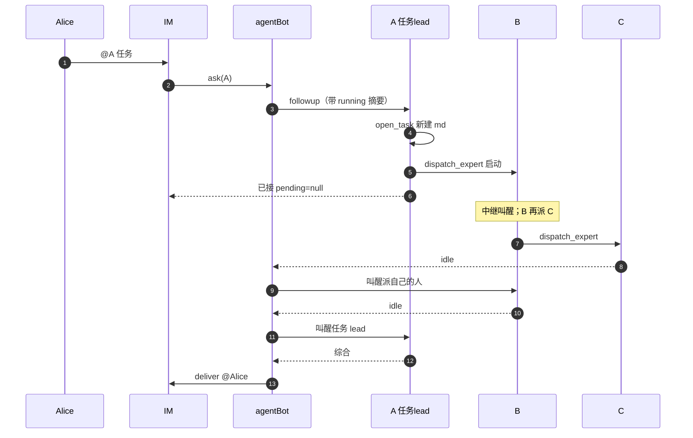

# 12. 群内专家协作（task board）

## 背景与目标

agent-bot 现在 `ask` 是单 agent 路由：`req.agentId -> AgentConfig -> ensureAgent + followup + settleAskRound`（见 [03](03-ask-and-session.md)、`runtime.ts`）。

本需求支持：群里 **谁被 @，谁就是这一单的任务 lead**。没有专职 lead 配置。所有 agent 都是专家，都可以接单、都可以派人。状态不靠信封 / JSON job / 问卷码，靠一份全员可读的 markdown。

人 `@A` 来活 → A 扫本群 `running/` 里的 md，LLM 自己认是捡起同一单还是新建 → 自己做，或派给群里其它专家。**派完即结束本轮 turn**（出站「已接，正在请 {name}」），被派的专家由中继立刻叫醒。专家按 access 和自身状态决定现在做 / 排队、并行 / 串行、新会话 / 续。做完改同一份 md，叫醒 **派自己的人**；叫醒链回到任务 lead 后，经通道 `deliver` @ 原发送者。

Alice 的任务与 Bob 的任务各一份 md（`owner` 不同），互不取消。直 @ 某专家与协作派发 **看见同一块板**，不会各做各的。

不引入 DSH 原生 `subagent` / `workflow` / `ralph`，不走 `spawnTeammate`。专家仍走 agent-bot `ensureAgent`，保住 `agents.json` 里的 workspace / skill_groups / permission_mode。规划拆解仍可用 DSH 自带 `todo`（各会话一份）；**当前任务的真相是 md**，不是会话内 todo。

流程用例见 [12-cases](./12-leader-experts-teamwork-cases.md)。

## 协作规则

1. **没有专职 lead。** 不设 `is_lead`。任务 lead = 这一单 md 上的 `taskLead`（最初被 @、并创建或捡起该文件的 agent）。之后谁领到都能再派，**不改** `taskLead`。
2. **一份任务一份 md。** 落在中枢配置根 `jobs/{todo|running|done}/task_{id}.md`。frontmatter 由运行时维护；正文由模型写。巡检 / 叫醒 / 综合 **只认文件**，不另做 JSON 信封。
3. **不做运行时硬匹配。** 人不用带任务号。入站 agent 读本群 `running/`（及本 owner 未回填的待决）全部短摘要，LLM 自己认捡起还是新建。认错会串单或拆单，靠 md 写清 owner / 摘要降低概率。
4. **派发立刻叫醒。** `dispatch_expert` 成功即 `ensureAgent` + `followup`，人不必再 @ 被派的专家。
5. **做完叫醒派自己的人。** C 由 B 派出 → 先叫醒 B；B 收口后再叫醒 A。只有任务 lead 的产出经 `deliver` 回群（入站 turn 里问人除外）。
6. **拍板先问任务 lead。** 被派专家缺信息：问题上抛给 `taskLead`（写入 md + 叫醒 A）。A 能定：改 md，再叫醒提问的人。A 不能定：问人。
7. **人 @ 任务 lead 或任一已派专家都行。** 谁被 @ 谁读同一份 md 的待决题，LLM 自己认。不抠 `A1` 码。旁人（非 owner）不当这一单的答案，可开自己的任务。
8. **read 并行；write 同 target FIFO。** 占着仍可派（下发成功）。不同 target 的 write 看被派专家的 `concurrency`。
9. **真答案只进下一次 followup**，不进原 `ask_user_question`。

## 角色

| 角色 | 本质 | 改动 |
|---|---|---|
| 专家 | 普通 `AgentConfig` | setup 都注册看板工具。被派时包装 prompt：你在做共享任务板上的一单，不是在对群友说话 |
| 任务 lead | 某一份 md 上的字段，不是 agent 类型 | 最初被 @ 的那个 agent；负责问人、综合、`deliver` 回群 |
| IM Provider | 现有通道插件 | 登记时提供 `listGroupAgents`、收口用的 `deliver` |
| 看板 + 中继 | 新需求点，独立目录 | md 读写、`dispatch_expert`、叫醒链、磁盘 FIFO |

入站 `ask` 仍走通道 `settleAskRound` 的队列；派发后的专家跑、叫醒、综合不走通道 `ask`，走内部 followup + `deliver`。不引入新 agent 类型。

## AgentConfig

见 [4](04-config-model.md)、[7](07-agent-tab.md)。协作相关字段：

| 字段 | 默认 | 含义 |
|---|---|---|
| `concurrency` | `serial` | cwd 安全阀。`serial`：即使不同 target 的 `write` 也 FIFO；`concurrent`：不同 target 的 `write` 可并行。同 target 的 `write` 一律 FIFO；`read` 一律可并行 |
| `needs_target_workspace` | `false` | `true`：被 `dispatch_expert` / 直 @ 时必须带目标项目目录（产出写到那里）。自己的 `workspace` 仍是技能仓，**不改 cwd** |
| `agent_wait_timeout_ms` | 缺字段 = 用全局 | per-agent 覆盖单次 waitIdle；专家 `0` fallback 全局。任务墙钟看全局 `task_round_timeout_ms`，不用本字段表示永不超时 |

不设 `is_lead` / `delegate_reuse_session`。`session_by_sender` **不强制**：通道会话仍按该 agent 自己的开关。任务隔离靠 md 的 `owner`，不靠专职 lead。协作群建议打开按人隔离，避免 Alice / Bob 共用任务 lead 的对话记忆导致捡单串台。

不存 `children`、不存群 ID。群里有哪些专家由 Provider 按本轮 `sessionParts` 发现。

## Provider 协议

见 [2](02-provider-contract.md)。`registerProvider` 在 `{ id, label }` 之外可带：

```
listGroupAgents(sessionParts: Record<string, string>): GroupAgentInfo[]
deliver(req: { sessionParts: Record<string, string>; messages: AgentOutboundMessage[] }): Promise<void>
```

`GroupAgentInfo`：`{ agentId, name, description }`。技能卡片由大脑按 `agents.json` + `skills-map.json` 补齐。通道从 `sessionParts` 取群身份（`group_id`）。

约束：

- 入站派发 / 再派时调用。直 @ 且 LLM 判定自己做、不派：可以不调；`list_group_experts` 仍用本任务已缓存的快照（见下）。
- 缺 `listGroupAgents`、返回空、或过滤后只剩自己：清单为空。**自己回答**，不报「没有专家」。仅 `dispatch_expert` 调空清单 / 清单外 id 才显式报错。
- 返回的 `agentId` 不在 `agents.json`：丢掉并记日志。
- 清单不含调用方自己（大脑过滤）。
- **群快照按任务文件**：该 md 创建或第一次派发时缓存一份，写入 frontmatter。之后同一份 md 的派发 / 叫醒都用这一份，不重新扫群。另一份 md 各有自己的快照。
- 大脑不持 webhook、不 `inject` 通道服务。收口经可选 `deliver`。缺 `deliver`：任务能跑、lead 能综合，结果落日志，群里没有收口消息。

示例通道：配置投影，扫本进程 `robots[]`，`groups` 含本轮 `group_id` 的取其 `agentId`。运维前提：同一群要协作，须 **多台 bot 都加入该群、各自绑不同 agent**，且 `groups[]` 写上该群。漏配则发现不到；踢群但配置还在会幽灵成员。

## 任务文件

目录：`{AGENT_BOT_CONFIG_DIR}/jobs/`，缺省 `~/.dsh/storages/agentbot/jobs/`。

```
jobs/
  todo/       # 已建、还没有人开工（少见；通常直接进 running）
  running/    # 至少一路在做、排队、或等人拍板
  done/       # 结束 / 超时。保留文件、不自动删
```

一份任务一个文件 `task_{id}.md`。移动目录 = 改状态（`todo` → `running` → `done`），不另写 status 库。`done` / 超时 **保留文件**。运维自行清理。

### frontmatter（运行时写，模型可读不可直接改关键键）

模型用 `update_task` 改正文和允许的字段；`taskId` / `taskLead` / `owner` / `sessionParts` 创建后不可改。

```yaml
---
taskId: task_xxx
taskLead: <最初被 @ 的 agentId>
owner: <sender>
providerId: demo
sessionParts: { bot_id, group_id }
originContext: <原 @ 原文>
access: read | write
target: <write 时的目录，可选>
createdAt: <epoch ms>
deadlineAt: <epoch ms>
groupSnapshot: [{ agentId, name, description }]
assignees:
  - expertId: <agentId>
    dispatchedBy: <派他的 agentId>
    sessionId: <uuid>
    access: read | write
    target: <可选>
    status: running | idle | failed | waiting | need_decision
    wake: true | false
pendingHuman:                 # 无则省略
  questions: [...]
  askedBy: <当时问人的 agentId，通常是 taskLead>
  askedAt: <epoch ms>
---
```

正文：摘要、进展、待决题干（给人 / 模型看）。运行时 **不解析正文当状态**。

谁写文件：

| 事件 | 动作 |
|---|---|
| 入站 LLM 判定新任务 | 运行时建 `running/task_{id}.md`，`taskLead` = 本 agent，`owner` = sender |
| 入站 LLM 判定捡起 | 不新建；本轮绑那份文件 |
| `dispatch_expert` | 把目标写入 `assignees[]`，中继 followup；文件留在 `running/` |
| 专家 idle | 更新该 assignee `status=idle`，把收口文本追加进正文（运行时模板 + 模型摘要） |
| 问人 / 问任务 lead | 写入 `pendingHuman` 或正文待决；不移动目录 |
| 任务 lead 综合结束 | 移到 `done/` |
| 墙钟到点 | 见超时；移到 `done/` 或只作废待决 |

同一 `(providerId, 群, owner)` 允许多份 `running` 文件。新 @ 不取消旧文件。

## 工具

所有 agent-bot agent 的 setup 都注册下列工具（不再按 `is_lead` 分流）。被派专家 **可以** `dispatch_expert`（再派），不可以把 `taskLead` 改成自己。

| 工具 | schema | 行为 |
|---|---|---|
| `list_group_experts` | 无参 | 本任务快照的能力卡片 `experts[]`，以及 `running_experts[]`：本群卡片里此刻有未 idle 会话的专家（通道槽或任务槽都算）。跨群只给 `{ expertId, source }`，不带别人的 taskId |
| `list_tasks` | 无参 | 本群、本 Provider 下 `running/` 全部任务的短摘要（`taskId, taskLead, owner, access, summary, assignees, pendingHuman?`）。入站包装会带同样一份，工具供中途再查 |
| `open_task` | `{ taskId? }` | 有 `taskId`：绑那份（必须是本群 running）。无：新建并绑。未 open / 未因入站绑上就 `dispatch_expert`：工具报错 |
| `update_task` | `{ markdown?, access?, target?, summary? }` | 改本轮已绑任务的正文或允许字段。改不了 `taskLead` / `owner` |
| `dispatch_expert` | `{ expert_id, instruction, access, session?, title?, target_workspace?, wake? }` | 启动专家，尽快返回 `{ kind: 'running', sessionId }`，**不等** idle。`access` 必填。目标必须在本任务快照内且不是自己。缺合法 `target_workspace` 见下 |
| `ask_task_lead` | `{ questions }` | **仅当本 agent 不是 taskLead。** 写入 md 待决，拒绝在瀑布里干等，叫醒 `taskLead`。taskLead 自己调：工具报错（应走 `ask_user_question`） |

`ask_user_question`（DSH 自带）不另注册，按驱动槽拦截，见「决策链路」。

不做 `fill_pending`、不做问卷字母码、不做自定义 `team-tasks.json`。

### 专家能力卡片

与旧方案相同：lead / 任何派发方 **不**读专家 system prompt，不做关键词匹配。卡片进 `list_group_experts` 与派发 turn 的包装（**不**写进被派专家自己的 prompt）：

| 字段 | 来源 |
|---|---|
| `agentId` / `name` | `AgentConfig` |
| `description` | `AgentConfig.description`。空则省略 |
| `needs_target_workspace` | 布尔。`true` 时写明必须传目标项目目录 |
| `workspace` 候选 | **仅当** 该专家 `needs_target_workspace=true`：列出群里**其它** agent 的 `{ name, workspace }`。自己的路径不进候选 |
| `skills[]` | `skill_groups` 展开，`{ name, description }`。`name` = id posix 末段；`description` = `skills-map.json` 首段，缺则空串 |

未知 skill id 丢掉。`dispatch_expert.expert_id` 枚举来自本任务快照，不按技能名路由。

固定 section：先看 `list_tasks` / 入站附带的 running 摘要，捡起或 `open_task`；按卡片选人；每路 `access` 与当前任务一致或是其子任务；`needs_target_workspace` 必须带 `target_workspace`（优先卡片上的项目路径，禁止编造）；没合适专家就自己做。

## 入站怎么绑任务

入站 **不**在 followup 前绑文件。包装 prompt 带上本群 running 短摘要（含待决题）。模型调 `open_task` / `dispatch_expert` / 改待决 才绑。

| 谁发起 | 绑哪份 | 群快照 |
|---|---|---|
| 人 @ 某专家（不论像不像答问卷） | LLM 捡起 → 那份；`open_task` 无 id → 新建（本 agent = taskLead）。只自己答完、没派、没问人：不建文件，走普通单 agent `settleAskRound` | 新建本轮扫一份；捡起用文件里缓存的 |
| 中继叫醒（内部 followup） | 文件里那份 | 该文件已缓存的 |

内部 followup 必须带 `taskId`（fiber 绑定，不是让模型填）。A 的派发只写入 A 那份；B 再派 C 仍写入 **同一份**。

入站 turn 结束时文件必须在 `running/`，当且仅当：本轮成功 `dispatch_expert`，**或** 本 agent 作为 taskLead 调了 `ask_user_question`（允许 `assignees=[]`）。只自己答完：不写文件。

## 中继驱动

区别于通道 `ask`：不走 `prepareAsk`、不编通道 `sessionKey`、不走通道 pending。复用 `createAgentRuntime` + `waitIdleOrTimeout` / `summarizeOwnedInterval` / `toMarkdownMessages`。独立目录，不改通道 `ask.ts` 语义。

与直 @ **共用该专家的排队判定**（按 agentId + 这一单 access / target，不按 sessionKey）：`write` 同 target 进同一 FIFO；`read` 不排队。

`dispatch_expert` **只负责启动**：`ensureAgent` + `followup(instruction)` 成功后尽快返回 `{ kind: 'running', sessionId }`。非法 id、路径：显式报错。idle / 超时 / 待决由看板巡检收，**不**在派发方这一轮 await。

### 会话槽

记忆由这一次 `session` 决定（`reuse` | `new`），缺省 `reuse`。**不走**被派专家自己的 `session_by_sender` / `reuse_session`（直 @ 仍按专家配置）。

- 槽前缀 `task:{taskId}:{expertId}`，禁止撞通道 `encodeSessionKey`。同一任务同一专家默认续这一槽。
- `session=new`：新 uuid 写回该槽（旧 session 不 dispose，只是不再当这条任务的当前槽）。可带 `title` 调 `sessionTitle.rename`（失败打日志，不整轮失败）。
- `session=reuse`：槽在则续；超时 / prompt 指纹变了也开新 uuid 写回（与通道 ask 相同规则）。
- 回填 / 叫醒必须用 **当时那次** `dispatch_expert` 记下的 `sessionId`。

直 @ 通道槽：仍完全看该专家 `reuse_session` / `session_by_sender` / `session_timeout_minutes`。两套 key 都落在该专家 `agents[].sessions`。通道 key 永不带 `task:`；协作 key 必须以 `task:` 开头。

内部驱动把本轮 IM meta 只读注入专家 prompt 变量（`sender` / `provider_id` / `sessionParts` 各键）。另注入 `{{target_workspace}}`（未传则为 `-`）。

包装 followup：你是被派做共享任务板上的一单，不是在对群友说话；本任务 `access` 见 md；缺信息调 `ask_task_lead`（你不是 taskLead）或把问题写进结果后收口；不要只在正文里提问。然后才是派发方的 `instruction`。把 **该 md 全文**（frontmatter + 正文）一并注入。

专家 `cwd` = 该专家 `workspace`，**永不**改成目标项目。

#### 目标项目目录

`needs_target_workspace=false`：`dispatch_expert` **忽略** `target_workspace`。

`true`：

- `target_workspace` 必填，绝对路径（`~` 先展开），目录必须已存在。
- 缺省 / 相对 / 不存在 → 工具报错，**不**回落到专家 `workspace`。
- 注入 `{{target_workspace}}`；包装加一句：产出写到该目录，不要写到自己的 cwd。
- 直 @：context 没带绝对路径则 `ask_user_question` 问原发送者（该专家此时是 taskLead）。

### 执行时机（专家侧）

被叫醒后看这一单 `access` 和自己是否占着：

| 新这一单 | 行为 |
|---|---|
| `access=read` | **并行新会话**，不排队。同 target 正有 write 在跑时可能读到半成品；要等写完由派发方设 `wake` 或再派 |
| `access=write` 且与正在跑的某路 **同一 target**（同一 `target_workspace` / md `target`，或两边都没 target、会写专家 cwd） | 下发成功，进该专家这条 target 的 FIFO（`assignees[].status=waiting` 直到轮到） |
| `access=write` 且 target **明确不同** | `concurrency=concurrent`：并行；`=serial`：仍进该专家 FIFO |

专家也可以在本轮把自身 assignee 标 `waiting`（更新 md 后收口）：中继不视为失败，等派发方再次 `dispatch_expert` 或 FIFO 轮到再叫醒。占着仍可派，不报错。

直 @ 没有 `dispatch_expert.access`：该专家本轮先 `open_task`；未声明 access 当 `write` + cwd。磁盘锁仍按声明后的 access / target。

## 派发 turn 与 deliver

入站那一轮 **只负责自己做、派发或问人**，**不等** 被派专家跑完：

| 本轮结束时 | 出站 | 文件 |
|---|---|---|
| 启动了专家、没问人 | 运行时模板「已接，正在请 {name} 处理」（多名顿号），`pending=null`。**丢弃** 最后一条助手长文本 | `running/` |
| 调了 `ask_user_question`（无论有没有专家） | 问卷 markdown @owner，`pending=null`（不经 `deliver`）。不发长文本 | `running/`，`pendingHuman` 有值 |
| 没派、没问人 | 普通综合 markdown | 不写文件 |

入站 30min 到点（pending 安全阀）：

| 当时 | 出站 | 文件 |
|---|---|---|
| 已落盘且本轮没问人 | 模板「已接，正在请…」，**不**发「处理超时」 | 继续巡检 |
| 已落盘且本轮已捕获问卷 | 问卷 markdown，**不**改成「已接」也不发超时 | 继续 |
| 没派、没问人 | 通道「处理超时」 | 不写文件 |

真结果只走后续 `deliver` / 入站回填收口。

### 谁改状态（不是 LLM 去问进度）

Host 巡检器盯 `running/` 里各 `assignees` 的 idle（活性探针）。人的 @ 只负责任务开端和问卷回填。

| 事件 | 动作 |
|---|---|
| 某 assignee 终态且 `wake=true`、非 `need_decision` | **先**内部 followup 叫醒 `dispatchedBy`（可合并同一被叫醒方的多路刚终态）。禁止抢先让任务 lead 综合。这轮后又派 → 文件保持 running；问人 → `pendingHuman`；既没再派也无待决 → 若还有上游，再叫醒上游；若被叫醒的就是 taskLead 且专家已齐 → 综合 |
| 全部 assignee 终态、无 `pendingHuman`、无未消费 wake | 内部 followup **taskLead**（带 md 全文）。这轮又 `dispatch_expert`：当真启动，保持 running，这轮不 `deliver`。没再派、没问人 → idle 后 `deliver` @owner → 移到 `done/` |
| 被派专家 `ask_user_question` / `ask_task_lead` | 只交给巡检器：写入 md，叫醒 taskLead。该专家即使 `wake=true` 也只走本行，wake 留着 |
| 入站里 taskLead 自己 `ask_user_question` | 本轮 `messages` 带回问卷；写 `pendingHuman`。不经 `deliver` |
| 人 @ 某专家 | 一律 followup 该专家（带 running 摘要）。LLM 捡起并处理待决 → 改 md，叫醒当时在等的人；不捡 → 旧文件还挂着，本轮可新建 |
| 墙钟 `deadlineAt` | 见超时。已在综合 followup 或 wake 已在 FIFO 排队：**不做** timeout，把这次内部 followup 做完 |

`deliver` 失败：打日志并有界重试，不重跑专家；仍失败则文件留在 `running/` 待进程起来再 deliver。

`deliver({ sessionParts, messages })` 与 ask 出站同形；@ owner 写在 `atUserIds`。通道 markdown 若不吃 AT，正文同时写 `@name`。通道：`bot_id` 查 webhook（**按 robot.id**），`group_id` 当 toid。缺 `deliver`：只打日志。

`deliver` **不走** 入站 FIFO。叫醒 / 综合的内部 followup 走该专家当时记下的 `sessionId`；**任务 lead 的综合 / 入站** 共用 `(taskLead, 通道 sessionKey)` FIFO：B 的派发 turn 进行中，A 的综合等 A 那路 idle。Alice 与 Bob 若 `session_by_sender=true` 则两路 session，互不占队列。

### 重启

进程起来扫 `jobs/running/`：

1. 专家还 live → 继续等 idle
2. 专家已 idle 但未叫醒上游 / 未综合 → 按叫醒链补 followup
3. 已综合但 `deliver` 未成功 → 只重试 deliver
4. 多份文件各自恢复，互不取消

### 活性探针

窗口 `W` = 专家 `agent_wait_timeout_ms`；缺字段用全局；`0` fallback 全局。

```
renew = 0
loop renew < expert_liveness_max_renew:   # 默认 3
  wait = waitIdleOrTimeout(agent.whenIdle(), W)
  if idle: 记 status=idle，收口文本进 md
  live = host.agents().get(sessionId)
  if live != undefined: renew++; continue
  else:
    ensureAgent + followup(上次未完成 + 原 instruction + md)
    renew++; continue
续期用尽：该 assignee failed（带部分文本），不挡其它人
```

「还在执行」= `agents.get(id) != undefined`。不用 seq 推进判断。

## 超时分层

| 层 | 取值 | 作用 |
|---|---|---|
| 入站 `ask` | 全局 `agent_wait_timeout_ms` 默认 30min | **只覆盖派发 / 自己答这一轮** |
| 专家窗口 W | 同上；可覆盖；`0` fallback 全局 | 巡检器单次 waitIdle |
| 专家续期 | `expert_liveness_max_renew` 默认 3 | 还在跑则再等 W；挂了则重启再跑 |
| 任务墙钟 | `task_round_timeout_ms` 默认 **2h** | 初值 `deadlineAt = createdAt + 该值`。**禁止** `0` 表示永不超时 |

问卷发出时（本轮 `messages` 或 `deliver`）把 **该文件** 的 `deadlineAt` 改成「发出时刻 + `task_round_timeout_ms`」。`ask_task_lead` 只叫醒 A、人还没被问：**不**改 `deadlineAt`。回填后回到 running：不再改回 createdAt。

到点：

| 当时 | 动作 |
|---|---|
| 还有 assignee 未终态 | 整单超时，`deliver`「处理超时」@owner，移到 `done/`。专家 turn 不强制 dispose |
| 有 `pendingHuman` 且还有人在跑 | **只作废待决**（正文记「问卷超时未答」）。还在跑的继续，齐了再综合。**不**整单超时 |
| 有 `pendingHuman` 且已齐 / 0 专家 | 整单超时，`deliver`「处理超时」@owner |

到点只动 **这一份文件**。已在综合、或 wake 已在 FIFO：做完这次内部 followup，不截杀。

## 数据流

### @A 派给 B，B 再派 C



### 直 @ 且自己做完

与现有单 agent 相同：`ask(该专家)`，不写任务文件。见 [03](03-ask-and-session.md)。若直 @ 后派了人或问了人，该专家就是这份 md 的 taskLead。

## 决策链路

```
被派专家缺信息
  → ask_task_lead 或 ask_user_question（拦截）
  → 写入 md，拒绝瀑布干等，叫醒 taskLead
  → taskLead 能定：update_task，再 dispatch / followup 同一 sessionId
  → taskLead 不能定：ask_user_question → 入站则本轮 messages，内部则 deliver 问卷 @owner
  → 人 @taskLead 或 @任一已派专家：该 agent 读 md 待决，LLM 自己认
  → 认了：改 md，叫醒当时在等的人
  → 不认：旧待决还挂着，本轮可当新任务
```

直 @ 且该专家自己就是 taskLead：没有中间层，直接问人（本轮 messages）。

### 拦截 `ask_user_question`

DSH waterfall `user-questions/request`（agent-scoped）。Web GUI 是现成 answerer。agent-bot 在�� agent fiber 上挂自己的 answerer，**排在 Web 前面**：

1. 本 agent 不是该任务 taskLead → 当作 `ask_task_lead`：记入 md，拒绝提问，叫醒 taskLead。禁止假答案。
2. 本 agent 是 taskLead → 拒绝提问，问卷按「谁发起这一轮」发出（入站 messages / 内部 deliver）。
3. 未绑任务的直 @ → 与现网单 agent 问人相同：本轮 messages，停车在通道槽；有待决再 @ 该专家则 followup 自己认，idle 后消费。若本轮同时 `open_task` 了，待决改挂到文件上。

权限审批不拦截。非 `danger-full-access` 仍可能卡网页（与 [03](03-ask-and-session.md) 一致）。

禁止：answerer 自己等下一条 IM。禁止：从正文猜「请问…」当待决。

问卷文案：单条 markdown，题干 + 选项（有选项才编号，只印给人 / 模型看）。@ owner；通道不吃 AT 则正文 `@name`。附 md 里的摘要。**写明：请 @任务 lead 或本题相关专家回复；其它 bot 可能认不成同一单。**

## 验收标准

- 所有 agent 持有同一套看板工具；无 `is_lead`。`dispatch_expert` 不得以清单外 id 为目标。
- `@A` 入站带 running 摘要。未 `open_task` / 未捡起就 `dispatch_expert` 报错。
- 直 @ 不强制发现；清单空则自己答，不报错。taskLead 入站问人：本轮 messages，落 0 专家 running 文件。
- 卡片含 name / description / 技能；不注入专家 system prompt。`running_experts` 按 agent 自身未 idle 会话。
- 清单来自 Provider 配置投影，不是 `agents.json` 全集，不含调用方自己。
- `dispatch_expert` 成功返回 `{ kind: 'running', sessionId }`，不等 idle。再派写入 **同一份 md**，不改 `taskLead`。做完叫醒 `dispatchedBy`，最后才叫醒 taskLead 综合。
- 同一目标 `write` 执行 FIFO；`read` 并行。占着仍可派。
- 派发 turn `pending=null`，出站运行时模板「已接」，不采用助手长文本。缺 `deliver` 只打日志。
- 协作槽 `task:{taskId}:{expertId}`，与通道槽隔离。回填用当时 sessionId。
- `needs_target_workspace=true` 缺合法路径：工具报错；不改 cwd。
- 被派专家问人先到 taskLead；人 @taskLead 或 @已派专家均可，LLM 认同一份 md。不抠码。
- 进程重启：按 `running/` 文件恢复 live / 补叫醒 / 重试 deliver。

## 边界与不做项

- 不设专职 lead / `is_lead` / `fill_pending` / 问卷字母码 / JSON 信封。
- 不调用 `spawnTeammate` / 原生 subagent。
- 不做确定性自动 fan-out；分不分、分给谁由被 @ 的 LLM 看卡片决定。
- 不把 `taskLead` 改成再派的人。C 做完不直接 deliver 回群。
- 不做运行时硬匹配（不抠任务号 / `A1`）。
- 大脑不持 webhook。收口只经 `deliver`。非本任务的主动推仍走通道 skill。
- 不拦截审批 waterfall。
- 不给假成功答案。真答案只进下一次 followup。
- 不把原 `ask` 的 `pending` 挂到专家跑完。
- 新 @ 不取消旧 running 文件。不做显式作废（无 cancelled）；人不再跟等到墙钟。
- 同 message 双 write 同一目标：**不拒工具**，执行 FIFO。
- 不在 agent 上存群 ID / Provider 白名单。
- 专家之间 **不**共享 DSH 会话记忆；共享的只有任务 md。
