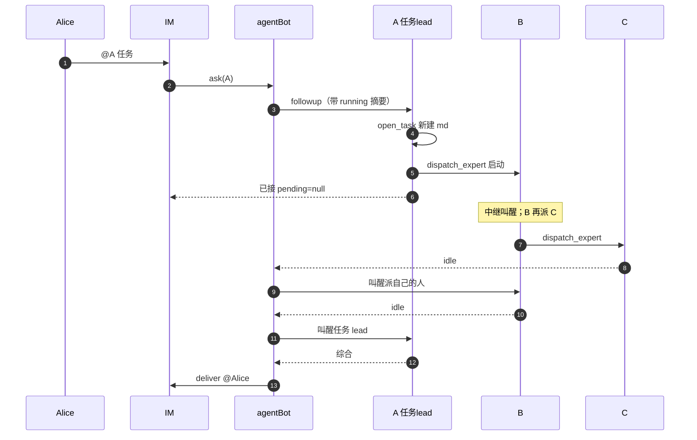

# 12. 群内专家协作（task board）

> **实现进度（SDD 标记）**：任务板模型（`task-board.ts`）、会话绑定（`binding.ts`）、中继（`relay.ts`）、六件看板工具（`board-tools.ts`）、巡检器（`patrol.ts` 含活性探针/超时/重启）、service 接线（toolsMount 挂载 + deliver 路由 + 入站 running 摘要包装）均已实现。测试见各 `*.test.ts`。
> 已实现：通道 key 含 `providerId`（防跨通道撞槽）；板可见性按 `providerId + conversationKey` 隔离（同群各台 bot 共享一块板、跨群不可见、local 共一块板）；`list_group_experts / list_tasks / open_task / update_task / dispatch_expert / ask_task_lead` 六工具；`task:` 协作槽隔离、write FIFO、叫醒链、deliver @sender 收口、重启按 `jobs/running/` 恢复；全局开关 `use_hub_experts`（默认 true=中枢全集）；`open_task` 新建任务（入站上下文提供 sender/providerId/群快照）；派发时 fiber 绑定协作槽 + prompt 带任务文件绝对路径；中间层派下游后 `waiting` 暂停、下游终态后恢复；**全终态 → 叫醒 taskLead 综合 → 取其该轮产出 deliver @sender → 移 `done/` + 解绑**；墙钟到点按会话状态分四种处理（顺延/进度反馈/救活/交回给人）；`jobs/cancel/` 人工取消；任务移走后自动解绑。
> 接管 `ask_user_question` 走的是「检测挂起 tool/call + 取消回合 + 非阻塞问人」，**不拦 waterfall**；
> `user-questions/request` 的 waterfall 本身不介入（认领会与人的 IM 回复形成死锁，见上）。
> 已知边界：同一专家在同一单只有一条 `assignees[]`（按 expertId 覆盖）；多人并行改同一份 md 无锁（读-改-写可能互相覆盖）；同一会话可能先后服务多单（路由判偏不锁死，真相是 md）。

## 背景与目标

agent-bot 现在 `ask` 是单 agent 路由：`req.agentId -> AgentConfig -> ensureAgent + followup + settleAskRound`（见 [03](03-ask-and-session.md)、`runtime.ts`）。

本需求支持：群里 **谁被 @，谁就是这一单的任务 lead**。没有专职 lead 配置。所有 agent 都是专家，都可以接单、都可以派人。状态不靠信封 / JSON job / 问卷码，靠一份全员可读的 markdown。

人 `@A` 来活 → A 扫本群 `running/` 里的 md，LLM 自己认是捡起同一单还是新建 → 自己做，或派给群里其它专家。**派完即结束本轮 turn**（出站「已接，正在请 {name}」），被派的专家由中继立刻叫醒。专家按 access 和自身状态决定现在做 / 排队、并行 / 串行、新会话 / 续。做完改同一份 md，叫醒 **派自己的人**；叫醒链回到任务 lead 后，经通道 `deliver` @ 原发送者。

Alice 的任务与 Bob 的任务各一份 md（`sender` 不同），互不取消。直 @ 某专家与协作派发 **看见同一块板**，不会各做各的。

不引入 DSH 原生 `subagent` / `workflow` / `ralph`，不走 `spawnTeammate`。专家仍走 agent-bot `ensureAgent`，保住 `agents.json` 里的 workspace / skill_groups / permission_mode。规划拆解仍可用 DSH 自带 `todo`（各会话一份）；**当前任务的真相是 md**，不是会话内 todo。

流程用例见 [12-cases](./12-leader-experts-teamwork-cases.md)。

## 协作规则

1. **没有专职 lead。** 不设 `is_lead`。任务 lead = 这一单 md 上的 `taskLead`（最初被 @、并创建或捡起该文件的 agent）。之后谁领到都能再派，**不改** `taskLead`。
2. **一份任务一份 md。** 落在中枢配置根 `jobs/{todo|running|done}/task_{id}.md`。frontmatter 由运行时维护；正文由模型写。巡检 / 叫醒 / 综合 **只认文件**，不另做 JSON 信封。
3. **不做运行时硬匹配。** 人不用带任务号。入站 agent 读本群 `running/`（及本 sender 未回填的待决）全部短摘要，LLM 自己认捡起还是新建。认错会串单或拆单，靠 md 写清 sender / 摘要降低概率。
4. **派发立刻叫醒。** `dispatch_expert` 成功即 `ensureAgent` + `followup`，人不必再 @ 被派的专家。
5. **做完叫醒派自己的人。** C 由 B 派出 → 先叫醒 B；B 收口后再叫醒 A。只有任务 lead 的产出经 `deliver` 回群（入站 turn 里问人除外）。
6. **拍板先问任务 lead。** 被派专家缺信息：问题上抛给 `taskLead`（写入 md + 叫醒 A）。A 能定：改 md，再叫醒提问的人。A 不能定：问人。
7. **人 @ 任务 lead 或任一已派专家都行。** 谁被 @ 谁读同一份 md 的待决题，LLM 自己认。不抠 `A1` 码。旁人（非 sender）不当这一单的答案，可开自己的任务。
8. **read 并行；write 同 target FIFO。** 占着仍可派（下发成功）。不同 target 的 write 看被派专家的 `concurrency`。
9. **真答案只进下一次 followup**，不进原 `ask_user_question`。

## 角色

| 角色 | 本质 | 改动 |
|---|---|---|
| 专家 | 普通 `AgentConfig` | setup 都注册看板工具。被派时包装 prompt：你在做共享任务板上的一单，不是在对群友说话 |
| 任务 lead | 某一份 md 上的字段，不是 agent 类型 | 最初被 @ 的那个 agent；负责问人、综合、`deliver` 回群 |
| IM Provider | 现有通道插件 | 登记时提供 `listGroupAgents`、收口用的 `deliver` |
| 看板 + 中继 | 新需求点，独立目录 | md 读写、`dispatch_expert`、叫醒链、磁盘 FIFO |

入站 `ask` 仍走通道 `settleAskRound` 的队列；派发后的专家跑、叫醒、综合不走通道 `ask`，走内部 followup + `deliver`。不引入新 agent 类型。

## AgentConfig

见 [4](04-config-model.md)、[7](07-agent-tab.md)。协作相关字段：

| 字段 | 默认 | 含义 |
|---|---|---|
| `concurrency` | `serial` | cwd 安全阀。`serial`：即使不同 target 的 `write` 也 FIFO；`concurrent`：不同 target 的 `write` 可并行。同 target 的 `write` 一律 FIFO；`read` 一律可并行 |
| `needs_target_workspace` | `false` | `true`：被 `dispatch_expert` / 直 @ 时必须带目标项目目录（产出写到那里）。自己的 `workspace` 仍是技能仓，**不改 cwd** |
| `agent_wait_timeout_ms` | 缺字段 = 用全局 | per-agent 覆盖单次 waitIdle；专家 `0` fallback 全局。任务墙钟看全局 `task_round_timeout_ms`，不用本字段表示永不超时 |

不设 `is_lead` / `delegate_reuse_session`。`session_by_sender` **不强制**：通道会话仍按该 agent 自己的开关。任务隔离靠 md 的 `sender`，不靠专职 lead。协作群建议打开按人隔离，避免 Alice / Bob 共用任务 lead 的对话记忆导致捡单串台。

不存 `children`、不存群 ID。

### 专家清单来源（全局开关 `use_hub_experts`，默认 `true`）

`config.json` 全局字段 `use_hub_experts`（布尔，默认 `true`）决定 `list_group_experts` / `dispatch_expert` 的专家清单来源：

| 值 | 来源 | 语义 |
|---|---|---|
| `true`（默认） | `agents.json` 全集 | 路线 b：中枢里所有 agent 都可被看到 / 派活，不看群快照。即使没绑任务，`list_group_experts` 也能列全集 + 技能卡片 |
| `false` | 群快照（Provider `listGroupAgents` 的投影） | 路线 a：专家 = 本任务 frontmatter 缓存的群快照，不含群外 agent；没绑任务时清单为空 |

- 列表 / 派发都按开关即时读配置（`loadConfig()` 有缓存语义），保存后下次调用工具即生效。
- 两种来源最终都用 `agents.json` + `skills-map.json` 补齐 `name` / `description` / 技能；不在 `agents.json` 的 id 仍丢掉。
- `dispatch_expert` 的目标校验跟着开关走：`true` 时目标必须在 `agents.json` 全集且不能是自己；`false` 时目标必须在本任务群快照内且不能是自己。

## Provider 协议

见 [2](02-provider-contract.md)。`registerProvider` 在 `{ id, label }` 之外可带：

```
listGroupAgents(sessionParts: Record<string, string>): GroupAgentInfo[]
deliver(req: { sessionParts: Record<string, string>; messages: AgentOutboundMessage[] }): Promise<void>
```

`GroupAgentInfo`：`{ agentId, name, description }`。技能卡片由大脑按 `agents.json` + `skills-map.json` 补齐。

**通道必须实现 `conversationKey(sessionParts)`**：把"这是哪个对话"压成一个字符串，用于**板可见性**过滤。
- 必须返回**群身份**（IM 取 `group_id`，飞书取 `chat_id`），**不要带 `bot_id`**
  —— 带上就同群各台 bot 各看各的板，直接破坏「直 @ 与协作派发看见同一块板」。
- 缺省实现取 `group_id`，取不到就退化成"把 sessionParts 规范化拼接"（**含 `bot_id`**），
  那等于按 bot 隔离 —— 所以用 `chat_id` 之类命名的通道**必须**实现这个钩子。

约束：

- 入站派发 / 再派时调用。直 @ 且 LLM 判定自己做、不派：可以不调；`list_group_experts` 仍用本任务已缓存的快照（见下）。
- 缺 `listGroupAgents`、返回空、或过滤后只剩自己：清单为空。**自己回答**，不报「没有专家」。仅 `dispatch_expert` 调空清单 / 清单外 id 才显式报错。
- 返回的 `agentId` 不在 `agents.json`：丢掉并记日志。
- 清单不含调用方自己（大脑过滤）。
- **群快照按任务文件**：该 md 创建或第一次派发时缓存一份，写入 frontmatter。之后同一份 md 的派发 / 叫醒都用这一份，不重新扫群。另一份 md 各有自己的快照。
- 大脑不持 webhook、不 `inject` 通道服务。收口经可选 `deliver`。缺 `deliver`：任务能跑、lead 能综合，结果落日志，群里没有收口消息。

示例通道：配置投影，扫本进程 `robots[]`，`groups` 含本轮 `group_id` 的取其 `agentId`。运维前提：同一群要协作，须 **多台 bot 都加入该群、各自绑不同 agent**，且 `groups[]` 写上该群。漏配则发现不到；踢群但配置还在会幽灵成员。

## 任务文件

目录：`{AGENT_BOT_CONFIG_DIR}/jobs/`，缺省 `~/.dsh/storages/agentbot/jobs/`。

```
jobs/
  todo/       # 已建、还没有人开工（少见；通常直接进 running）
  running/    # 至少一路在做、排队、或等人拍板
  done/       # 全部做完并已交付 / 人确认收口。保留文件、不自动删
  cancel/     # 人手工把 task_xxx.md 挪进来 = 取消这一单
```

一份任务一个文件 `task_{id}.md`。移动目录 = 改状态（`todo` → `running` → `done`），不另写 status 库。`done` / `cancel` **保留文件**。运维自行清理。

**`cancel/` 由人手工搬文件**（`mv jobs/running/task_x.md jobs/cancel/`）：巡检只扫 `running/`，文件一挪走就自然不再被叫醒、不再超时；对应会话一并解绑。不需要新工具，也不需要动 `taskLead`。

### frontmatter（运行时写，模型可读不可直接改关键键）

模型用 `update_task` 改正文和允许的字段；`taskId` / `taskLead` / `sender` / `sessionParts` 创建后不可改。

```yaml
---
taskId: task_xxx
taskLead: <最初被 @ 的 agentId>
sender: <sender>
providerId: demo
sessionParts: { bot_id, group_id }
originContext: <原 @ 原文>
access: read | write
target: <write 时的目录，可选>
createdAt: <epoch ms>
deadlineAt: <epoch ms>
groupSnapshot: [{ agentId, name, description }]
assignees:
  - expertId: <agentId>
    expertName: <AgentConfig.name 或 groupSnapshot 同名快照>  # 派发时写入；agent 改名不回填
    dispatchedBy: <派他的 agentId>
    dispatchedByName: <派发方的 name，同上>
    sessionId: <uuid>
    access: read | write
    target: <可选>
    status: running | idle | failed | waiting | need_decision
    wake: true | false
pendingHuman:                 # 无则省略
  questions: [...]
  askedBy: <当时问人的 agentId，通常是 taskLead>
  askedAt: <epoch ms>
---
```

正文：摘要、进展、待决题干（给人 / 模型看）。运行时 **不解析正文当状态**。

谁写文件：

| 事件 | 动作 |
|---|---|
| 入站 LLM 判定新任务 | 运行时建 `running/task_{id}.md`，`taskLead` = 本 agent，`sender` = sender |
| 入站 LLM 判定捡起 | 不新建；本轮绑那份文件 |
| `dispatch_expert` | 把目标写入 `assignees[]`（含 `expertName` / `dispatchedByName`，从快照解析），中继 followup；文件留在 `running/` |
| 专家 idle | 更新该 assignee `status=idle`，把收口文本追加进正文（运行时模板 + 模型摘要） |
| 问人 / 问任务 lead | 写入 `pendingHuman` 或正文待决；不移动目录 |
| 任务 lead 综合结束 | 移到 `done/` |
| 墙钟到点 | 见超时；移到 `done/` 或只作废待决 |

同一 `(providerId, 群, sender)` 允许多份 `running` 文件。新 @ 不取消旧文件。

## 工具

所有 agent-bot agent 的 setup 都注册下列工具（不再按 `is_lead` 分流）。被派专家 **可以** `dispatch_expert`（再派），不可以把 `taskLead` 改成自己。

| 工具 | schema | 行为 |
|---|---|---|
| `list_group_experts` | 无参 | 专家能力卡片（含 name / description / 技能），以及此刻未 idle 的专家（通道槽或任务槽都算）。来源随全局开关 `use_hub_experts`：开=`agents.json` 全集（没绑任务也能列）；关=本任务缓存的群快照。都不含调用方自己 |
| `list_tasks` | 无参 | 本群、本 Provider 下 `running/` 全部任务的短摘要（`taskId, taskLead, sender, access, summary, assignees, pendingHuman?`）。入站包装会带同样一份，工具供中途再查 |
| `open_task` | `{ taskId?, access?, target? }` | 有 `taskId`：绑那份（必须是本群 running）。无：**新建并绑**（本 agent = taskLead；`access` 缺省 `write`，`target` 可空），sender / providerId / sessionParts / 群快照取自入站上下文。未 open / 未因入站绑上就 `dispatch_expert`：工具报错 |
| `update_task` | `{ markdown?, access?, target?, summary?, clear_pending? }` | 改本轮已绑任务的正文或允许字段。改不了 `taskLead` / `sender`。`clear_pending=true` 清掉待决标记（拍板/回填后必须清，否则任务一直停在待决、永不交付） |
| `dispatch_expert` | `{ expert_id, instruction, access, session?, title?, target_workspace?, wake? }` | 启动专家，尽快返回 `{ kind: 'running', sessionId }`，**不等** idle。`access` 必填。目标必须在本任务快照内且不是自己。运行时据快照 / `AgentConfig` 填 `expertName` / `dispatchedByName` 写入 `assignees[]`。缺合法 `target_workspace` 见下 |
| `ask_task_lead` | `{ questions }` | **仅当本 agent 不是 taskLead。** 写入 md 待决，拒绝在瀑布里干等，叫醒 `taskLead`。taskLead 自己调：工具报错（应走 `ask_human`） |
| `ask_human` | `{ questions }` | **仅 taskLead 可用。** 把问题上抛给**人**：写 `pendingHuman{..., toHuman:true}` → 巡检 `deliver` 问卷 @sender，并把**墙钟顺延**成「发出时刻 + 一个墙钟」等人回答 |

`ask_user_question`（DSH 自带）不另注册，按驱动槽拦截，见「决策链路」。

不做 `fill_pending`、不做问卷字母码、不做自定义 `team-tasks.json`。

### 专家能力卡片

与旧方案相同：lead / 任何派发方 **不**读专家 system prompt，不做关键词匹配。卡片进 `list_group_experts` 与派发 turn 的包装（**不**写进被派专家自己的 prompt）：

| 字段 | 来源 |
|---|---|
| `agentId` / `name` | `AgentConfig` |
| `description` | `AgentConfig.description`。空则省略 |
| `needs_target_workspace` | 布尔。`true` 时写明必须传目标项目目录 |
| `workspace` 候选 | **仅当** 该专家 `needs_target_workspace=true`：列出群里**其它** agent 的 `{ name, workspace }`。自己的路径不进候选 |
| `skills[]` | `skill_groups` 展开，`{ name, description }`。`name` = id posix 末段；`description` = `skills-map.json` 首段，缺则空串 |

未知 skill id 丢掉。`dispatch_expert.expert_id` 枚举来自本任务快照，不按技能名路由。

固定 section：先看 `list_tasks` / 入站附带的 running 摘要，捡起或 `open_task`；按卡片选人；每路 `access` 与当前任务一致或是其子任务；`needs_target_workspace` 必须带 `target_workspace`（优先卡片上的项目路径，禁止编造）；没合适专家就自己做。

## 入站怎么绑任务

入站 **不**在 followup 前绑文件。包装 prompt 带上本群 running 短摘要（含待决题）。模型调 `open_task` / `dispatch_expert` / 改待决 才绑。

入站时把本轮的 **sender / providerId / sessionParts / 群成员快照** 记进「入站上下文」（按 sessionId 存内存），供本轮里的 `open_task` 新建时取用——工具作用域里本来没有这些。
选哪条会话见 §会话分层与入站路由。

**板可见性按「对话」隔离**：列出 `running/` 时只给**同一个对话**的任务 —— 判据 = 同 `providerId` **且** 同 `conversationKey(sessionParts)`。
`conversationKey` 由通道定义（IM 取 `group_id` / 飞书 `chat_id`；**不含 `bot_id`**，否则同群各台 bot 会各看各的板）；缺省实现取 `group_id`，没有则把 `sessionParts` 规范化拼接。
内置 `local` 的 `conversationKey` **恒为一个常量**（本地没有"群"概念，整台中枢的 local 共用一块板），避免"换个网页会话就看不见旧单 → 重复建单"。
但**路由**对 local 更细：只续「**这条会话**起过的单」（`task.sessionParts.session === 本轮 session 值`）——`sender` 在 local 恒为 `'local'`，不收紧的话开个新话题也会被吸进上一单。
定位不了自己的对话（既无入站上下文也无绑定任务）→ **不列**并提示，不返回全部。

LLM 拿到的判据就三样：running 摘要、自己的技能、专家卡片。决策：

| 判断 | 动作 |
|---|---|
| 这条消息属于正在做的那一单 | 捡起：`open_task(taskId)` 绑上，**复用该单的会话**继续（通道槽 `reuse_session` 不强制重开） |
| 不是已有单，但自己的技能能做 | 直接做，不建文件（普通 `settleAskRound`） |
| 不是已有单，自己也做不了 | `open_task` 无 id → **新建** `running/task_{id}.md`（本 agent = taskLead），再按卡片 `dispatch_expert` 或 `ask_user_question` |

新建的 `groupSnapshot` 来源随全局开关 `use_hub_experts`：开=`agents.json` 全集；关=本轮 `listGroupAgents` 投影。两种都按 `agents.json` 过滤幽灵成员、去掉调用方自己。

| 谁发起 | 绑哪份 | 群快照 |
|---|---|---|
| 人 @ 某专家（不论像不像答问卷） | LLM 捡起 → 那份；`open_task` 无 id → 新建（本 agent = taskLead）。只自己答完、没派、没问人：不建文件，走普通单 agent `settleAskRound` | 新建本轮扫一份；捡起用文件里缓存的 |
| 中继叫醒（内部 followup） | 文件里那份（派发时已 fiber 绑定） | 该文件已缓存的 |

内部 followup 必须带 `taskId`（fiber 绑定，不是让模型填）。A 的派发只写入 A 那份；B 再派 C 仍写入 **同一份**。

`open_task` 无 id 且当前不是入站回合（没有入站上下文，如中继内部 followup）→ 显式报错，让它带 `taskId` 捡起。

入站 turn 结束时文件必须在 `running/`，当且仅当：本轮成功 `dispatch_expert`，**或** 本 agent 作为 taskLead 调了 `ask_user_question`（允许 `assignees=[]`）。只自己答完：不写文件。

## 中继驱动

区别于通道 `ask`：不走 `prepareAsk`、不编通道 `sessionKey`、不走通道 pending。复用 `createAgentRuntime` + `waitIdleOrTimeout` / `summarizeOwnedInterval` / `toMarkdownMessages`。独立目录，不改通道 `ask.ts` 语义。

与直 @ **共用该专家的排队判定**（按 agentId + 这一单 access / target，不按 sessionKey）：`write` 同 target 进同一 FIFO；`read` 不排队。

`dispatch_expert` **只负责启动**：`ensureAgent` + `followup(instruction)` 成功后尽快返回 `{ kind: 'running', sessionId }`。非法 id、路径：显式报错。idle / 超时 / 待决由看板巡检收，**不**在派发方这一轮 await。

### 会话槽

记忆由这一次 `session` 决定（`reuse` | `new`），缺省 `reuse`。**不走**被派专家自己的 `session_by_sender` / `reuse_session`（直 @ 仍按专家配置）。

- 槽前缀 `task:{taskId}:{expertId}`，禁止撞通道 `encodeSessionKey`。同一任务同一专家默认续这一槽。
- `session=new`：新 uuid 写回该槽（旧 session 不 dispose，只是不再当这条任务的当前槽）。可带 `title` 调 `sessionTitle.rename`（失败打日志，不整轮失败）。
- `session=reuse`：槽在则续；超时 / prompt 指纹变了也开新 uuid 写回（与通道 ask 相同规则）。
- 回填 / 叫醒必须用 **当时那次** `dispatch_expert` 记下的 `sessionId`。

直 @ 通道槽：仍完全看该专家 `reuse_session` / `session_by_sender` / `session_timeout_minutes`。两套 key 都落在该专家 `agents[].sessions`。通道 key 永不带 `task:`；协作 key 必须以 `task:` 开头。

**通道 key 显式含 `providerId`**（对齐 `<provider>_<sessionParts 各值>[_<sender>]`）：原来只用 `sessionParts` 的值拼，
不同通道若 `bot_id` / `group_id` 取值撞上会**共用同一个槽**（跨通道串台）。`agentId` 不必进 key —— 每个 agent 有自己的 `agents[].sessions`。

#### 会话分层与入站路由

两类会话，职责不同：

| 层 | key | 用途 |
|---|---|---|
| **前台槽**（对话级） | `<provider>_<sessionParts 各值>[_<sender>]` | 收人的消息、认单、汇报；以及"还没归属到某一单"的对话 |
| **任务槽**（任务级） | `task:{taskId}:{agentId}` | 已归属某一单的对话与干活（含 taskLead 自己的活；被派专家也走这里） |

**入站路由**（在 turn 开始**之前**，只用客观状态，不抠任务号）：

1. 该 `sender` 在某 `running` 单上有**未回填待决** → 进那一单的任务槽（他就该在这一单里说话）
2. 否则该对话里该 `sender` **最近绑定**的 `running` 单 → 进那一单的任务槽
3. 都没有 → 进**前台槽**

**路由目标 = `task:{taskId}:{本 agent}`**（**本** agent 在该单的任务槽），不是「taskLead 的会话」——人明明 @ 的是 B，话不能被送到 A 那边。

**LLM 保留最终决定权**：路由只决定「从哪条会话起步」，任务归属仍由 LLM 的 `open_task`（捡起 / 新建）决定，并把当前会话绑上去（`binding`，现状）。所以路由判偏（例如人说"对了还有个事"被归到上一单）**不会锁死**：LLM 读 running 摘要后照样可以新建一单。

用例：**人 @B 问 A 那一单** → B 的入站带本群 running 摘要 → B 看得到 `task_x`（taskId / lead=A / 摘要 / 待决）→
B 可 `open_task(task_x)` 捡起（复用**同一份 md**，接着做 / `update_task` / 再 `dispatch_expert`），也可只按摘要口头答复。
**`taskLead` 不变**（仍是 A），最终交付回群仍由 A 收口；B 不直接 `deliver`。

已知不完美：同一会话可能先后服务多单（LLM 在某单的会话里新建/切换任务时）。**真相始终是 md**，会话只是记忆载体。

> 为什么不在路由里直接定任务：那需要"先知道属于哪一单才能选会话"，而认单本身要先把 turn 跑起来 —— 循环。
> 也不用两次 LLM（先判定再干活）：延迟与成本翻倍，且判错比"进错会话"更难挽回。

内部驱动把本轮 IM meta 只读注入专家 prompt 变量（`sender` / `provider_id` / `sessionParts` 各键）。另注入 `{{target_workspace}}`（未传则为 `-`）。

包装 followup：你是被派做共享任务板上的一单，不是在对群友说话；本任务 `access` 见 md；缺信息调 `ask_task_lead`（你不是 taskLead）或把问题写进结果后收口；不要只在正文里提问。然后才是派发方的 `instruction`。把 **该 md 全文**（frontmatter + 正文）一并注入，**并给出该任务文件的绝对路径**（`{configDir}/jobs/running/{taskId}.md`），让专家可以随时自己重读最新版本。

**派发时 fiber 绑定**：`startTurn` 在解析出协作槽 sessionId 后，把它绑到本 `taskId`（`binding`）。被派专家因此不必自己填 `taskId`——它一进来就「已经在做这一单」，`update_task` / `ask_task_lead` / 再 `dispatch_expert` 直接可用。任务移入 `done/` 时解绑。

专家 `cwd` = 该专家 `workspace`，**永不**改成目标项目。

#### 目标项目目录

`needs_target_workspace=false`：`dispatch_expert` **忽略** `target_workspace`。

`true`：

- `target_workspace` 必填，绝对路径（`~` 先展开），目录必须已存在。
- 缺省 / 相对 / 不存在 → 工具报错，**不**回落到专家 `workspace`。
- 注入 `{{target_workspace}}`；包装加一句：产出写到该目录，不要写到自己的 cwd。
- 直 @：context 没带绝对路径则 `ask_user_question` 问原发送者（该专家此时是 taskLead）。

### 执行时机（专家侧）

被叫醒后看这一单 `access` 和自己是否占着：

**串行域 = 目标目录（target workspace），不是任务。** 三种情形：

| 这一路 | 行为 |
|---|---|
| `access=read` | **并行**，不占锁、不排队（同 target 正有 write 在跑时可能读到半成品） |
| `access=write`，且该目标目录**已有 write 在跑** | 下发成功即**进队列**：`assignees[].status=waiting`，**不立即叫醒**；同时把 `instruction` 存进 assignees（轮到时要拿它重启） |
| `access=write`，目标目录**空着** | 立刻占锁 + 叫醒 |
| 不同目标目录 | **并行**（各自一把锁） |

目标目录的取法：`assignee.target` → `task.target` → 该专家 cwd（三者取第一个有值的），并**归一化**
（展开 `~`、去尾斜杠、解软链）后比较；**互为祖先也算冲突**（`/proj` 与 `/proj/design` 串行，
因为往 `/proj` 写完全可能覆盖 `/proj/design` 里的文件）。

**不做文件级锁**（边界）：LLM 是运行时才决定改哪些文件的（bash / 编辑工具），事前不可知；
`access` 与 `target` 都是**声明**，不是沙箱——专家完全可以去改声明之外的文件。
所以同文件并发写只会出现在「两路都声明了不重叠的目录、却都去改第三处」这种误用。
要更强的保证只能上文件系统级隔离，不在本需求范围。

**md（簿记）的写入**：所有写入都走「重读 → 改 → 写」的**同步小段**。工具本来就在同步段内完成
（`bound()`→改→`writeTask` 之间没有 await，单线程下天然原子）；要防的是**巡检**——它常常
「读快照 → await（等 idle / deliver / 等 lead 拍板）→ 写回」，直接写会把这段期间别人写进 md 的
内容覆盖掉。所以巡检的所有写入统一走 `patchTask`（重读后改再写）。

**锁的释放与推进**：某个 write 那一轮结束（会话 idle）或判 `failed` 时 → 释放该目标锁 →
在同一目标的 `waiting` 队列里按 md 顺序取第一个启动（`status=running`、`wake=true`、用它存下的 `instruction`）。
锁是**进程级共享**的（`getWriteFence`）——`buildRelay` 是每个 agent 会话各建一份的，栅栏若跟着会话建，
同一 target 的两个专家会各拿一把锁，串行直接失效。占位会话用 `agents.get(sessionId)` 判活性，进程重启后锁自动失效回退。

专家也可以在本轮把自身 assignee 标 `waiting`（更新 md 后收口）：中继不视为失败，等派发方再次 `dispatch_expert` 或 FIFO 轮到再叫醒。占着仍可派，不报错。

#### 中间层暂停与恢复（B 派 C）

被派专家 B 自己**还能再派** C。B 派完 C 后不是「做完」，而是**暂停等下游**：

| 时机 | B 的 `assignees[].status` | 说明 |
|---|---|---|
| A 派 B | `running` | B 开工 |
| B 派了 C（B 是这单的 assignee） | **`waiting`** | B 本轮收尾 → 暂停。`waiting` **不算终态**，所以不会上报给 A |
| C（及 B 派出的全部下游）都终态 | `running` | 上报链叫醒 B，B **恢复继续做自己的活** |
| B 自己这一轮真正结束 | `idle`（巡检探针转态） | 这时才算做完，才上报给 A |

要点：
- 一个中间层可能有多路下游，**全部**终态才恢复它。
- 恢复时把它的状态从 `waiting` 改回 `running`（它开始干活了），否则巡检不再探它、它永远停在 `waiting`。
- 若中间层派下游时用的是 `wake=false`，语义同上：仍然进 `waiting`，等下游终态后恢复。

直 @ 没有 `dispatch_expert.access`：该专家本轮先 `open_task`；未声明 access 当 `write` + cwd。磁盘锁仍按声明后的 access / target。

## 派发 turn 与 deliver

入站那一轮 **只负责自己做、派发或问人**，**不等** 被派专家跑完：

| 本轮结束时 | 出站 | 文件 |
|---|---|---|
| 启动了专家、没问人 | 运行时模板「已接，正在请 {name} 处理」（`{name}` 取本轮 `assignees[].expertName`，多名顿号），`pending=null`。**丢弃** 最后一条助手长文本 | `running/` |
| 调了 `ask_user_question`（无论有没有专家） | 问卷 markdown @sender，`pending=null`（不经 `deliver`）。不发长文本 | `running/`，`pendingHuman` 有值 |
| 没派、没问人 | 普通综合 markdown | 不写文件 |

入站 30min 到点（pending 安全阀）：

| 当时 | 出站 | 文件 |
|---|---|---|
| 已落盘且本轮没问人 | 模板「已接，正在请…」，**不**发「处理超时」 | 继续巡检 |
| 已落盘且本轮已捕获问卷 | 问卷 markdown，**不**改成「已接」也不发超时 | 继续 |
| 没派、没问人 | 通道「处理超时」 | 不写文件 |

真结果只走后续 `deliver` / 入站回填收口。

### 谁改状态（不是 LLM 去问进度）

Host 巡检器盯 `running/` 里各 `assignees` 的 idle（活性探针）。人的 @ 只负责任务开端和问卷回填。

| 事件 | 动作 |
|---|---|
| 某 assignee 终态且 `wake=true`、非 `need_decision` | **先**内部 followup 叫醒 `dispatchedBy`（可合并同一被叫醒方的多路刚终态）。禁止抢先让任务 lead 综合。这轮后又派 → 文件保持 running；问人 → `pendingHuman`；既没再派也无待决 → 若还有上游，再叫醒上游；若被叫醒的就是 taskLead 且专家已齐 → 综合。**该 assignee 自己还有未终态的下游**（它派出去的人仍 `running`/`waiting`/`need_decision`）时不算「终态」，本轮不叫醒它的 `dispatchedBy`——否则上级会被提前叫醒、赶在下游出结果前答复 |
| 全部 assignee 终态、无 `pendingHuman`、无未消费 wake | 内部 followup **taskLead**（带 md 全文）。这轮又 `dispatch_expert`：当真启动，保持 running，这轮不 `deliver`。没再派、没问人、也没待决 → **取 taskLead 这一轮的产出 `deliver` @sender，然后移到 `done/` 并解绑** |
| taskLead 综合完成（交付） | **收口**：把 taskLead 这一轮（被叫醒那一轮）的 assistant 文本经 `deliver` 发回**原发送者所在的会话**（`providerId` + 任务里的 `sessionParts`），`@sender`；随后 `moveTask('running','done')` + 解绑该任务所有会话。综合后又派了活 → 不交付，保持 `running` |
| 交付面（deliver 目标） | 优先发回这一单**原发送者所在的那条会话/群**（任务 frontmatter 里记的 `providerId` + `sessionParts`）。人不在群里 / 通道不支持 deliver → 退化为写日志，任务仍收口 |
| 被派专家 `ask_user_question` / `ask_task_lead` | 只交给巡检器：写入 md，叫醒 taskLead。该专家即使 `wake=true` 也只走本行，wake 留着 |
| 待决分两种 | `pendingHuman.toHuman` 缺省 = 上抛给 taskLead（巡检叫醒 lead 拍板）；`=true` = **给人**的问卷（巡检 `deliver` @sender 并**顺延墙钟**）。两种都按「askedAt + 问题」指纹去重，不会因触发分支措辞不同而重复发 |
| 待决的**自动清除**（不靠模型记得） | ① **上抛给 taskLead 的**：巡检叫醒 lead 并**等它这一轮结束**，若待决没被换成新的（`askedAt` 未变）就自动清掉；② **给人的问卷**：人 @ 该会话并说完这一轮后，入站收尾处自动清（同一 `askedAt` 才清，换了新问题就保留）；③ 也可显式 `update_task{clear_pending:true}` |
| lead 这轮又问了新问题 | `askedAt` 变了 → **保留新的那份**，不误清 |
| 入站里 taskLead 自己 `ask_user_question` | 本轮 `messages` 带回问卷；写 `pendingHuman`。不经 `deliver` |
| 人 @ 某专家 | 一律 followup 该专家（带 running 摘要）。LLM 捡起并处理待决 → 改 md，叫醒当时在等的人；不捡 → 旧文件还挂着，本轮可新建 |
| 墙钟 `deadlineAt` | 见超时。已在综合 followup 或 wake 已在 FIFO 排队：**不做** timeout，把这次内部 followup 做完 |

`deliver` 失败：打日志并有界重试，不重跑专家；仍失败则文件留在 `running/` 待进程起来再 deliver。

`deliver({ sessionParts, messages })` 与 ask 出站同形；@ sender 写在 `atUserIds`。通道 markdown 若不吃 AT，正文同时写 `@name`。通道：`bot_id` 查 webhook（**按 robot.id**），`group_id` 当 toid。缺 `deliver`：只打日志。

`deliver` **不走** 入站 FIFO。叫醒 / 综合的内部 followup 走该专家当时记下的 `sessionId`。

**按人隔离只作用在通道槽（前台）**：Alice 与 Bob 若该 agent `session_by_sender=true` 则两路前台会话，互不占队列。
**任务槽一律不按人分**（key = `task:{taskId}:{agentId}`）：任务槽天生是「这一单」的共享工作上下文（一单一 md、同群一块板），单内两人共享记忆；人的区分在 md 的 `sender` 字段上。要按人隔离就调该 agent 的 `session_by_sender`，不引入新开关。

### 叫醒谁、用哪条会话、叫几次

「走该专家当时记下的 `sessionId`」的取法（**必须是 sessionId，不是槽 key**）：

| 被叫醒方 | 用哪条会话 |
|---|---|
| 被派专家（在这份 md 的 `assignees[]` 里） | **协作槽**会话 = `assignees[].sessionId`。纯被派、从没被人直 @ 过的中间层也照样叫得醒 |
| taskLead（人 @ 进来的） | 用本任务记的 `providerId` + `sessionParts`（`session_by_sender=true` 时再加 `sender`）反推出**通道槽 key**，再取该槽的 `sessionId`。禁止「随便取第一条非协作槽」——一个 agent 可能在多个群 / 多条按人会话，会叫错群、叫错人 |

去重：同一份任务会被多个触发（事件、墙钟、入站复核）反复处理，**必须有「已叫醒」记忆**，否则会对同一个被叫醒方反复灌 followup。判定用「被叫醒方相关的完成情况指纹」（它那几路下游/全部 assignee 的 `expertId:status` 集合）；指纹没变就不再叫，变了才叫。指纹存**内存**：进程重启后按 §重启 补叫一次，正是想要的恢复行为。

多级链（A → B → C）：C 终态 → 按协作槽叫醒 B；B 收口后再终态 → 按通道槽叫醒 A（taskLead）；A 综合后 `deliver`。中间层不需要是人 @ 过的。

### 重启

进程起来 `patrol.start()` 扫一次 `jobs/running/`（并重建墙钟定时器）：

1. 专家还 live → 继续等 idle
2. 专家已 idle 但未叫醒上游 / 未综合 → 按叫醒链补 followup
3. 已综合但 `deliver` 未成功 → 只重试 deliver
4. 多份文件各自恢复，互不取消

### 唤醒路径：纯事件驱动（无周期轮询）

**没有任何周期扫描循环。** 只在四件事上醒来：

| 触发 | 来源 | 做什么 |
|---|---|---|
| 专家会话变 idle | cordis `agent/status` 事件 | `notifyAgentIdle(sessionId)` → `patrol.reconcile`：转 `idle` → 跑这一单（上报/综合/交付） |
| 专家会话被销毁 | cordis `agent/disposed` 事件 | `notifyAgentDisposed(sessionId)` → 重启那一路；续期耗尽则判 `failed` 并走状态机 |
| 任务墙钟到点 | **每份任务一个 `setTimeout(deadlineAt - now)`** | 跑这一单的超时分析（顺延/救活/交回给人/收口）；顺延后重排定时器 |
| 进程启动 | `patrol.start()` | **一次性**扫 `running/`：补上报（订阅生效前完成的工作）+ 重建墙钟定时器 |
| 有人入站互动 | `ask` 结束后 | **交互兜底**：顺手 `reconcile(该会话)`，漏掉的事件在这一刻补上 |

约束与取舍：
- 事件是**全进程**的：先按键 `boundTaskId(sessionId)` / 扫 `running/` 里 `assignees[].sessionId` 过滤；
  不是本插件的会话（用户网页会话、cron-loop 会话）直接忽略。
- 事件同步 emit，回调里**不 await 重活**（丢微任务，失败只打日志），免得拖慢派发链。
- `agent/status` / `agent/disposed` 的事件名与 payload **本地声明**，不 import `@deepseek-ai/dsh-agent`
  （该包在插件运行时不可解析；cordis 的 events 是根级单例，插件级 `ctx.on` 收得到全进程事件）。
- 墙钟定时器是**内存态**：进程重启会丢，由 `start()` 的补扫重建。
- 没有任何兜底扫描 ⇒ 漏事件的唯一自愈路径是「启动扫一次」与「入站互动时复核」。
  这是去掉轮询的代价：若事件丢失且无人再与这单互动，该单会停在原地等下一次互动。

### 内置 `ask_user_question` 的接管（按来源分流）

DSH 自带的 `ask_user_question` 会**阻塞**发起它的那一轮，等网页 answerer 回答。IM 来的任务里
没人看网页 ⇒ 回合被卡住。按**任务来源**分流：

| 任务来源 | 处理 |
|---|---|
| **IM**（`providerId` ≠ `local`） | **接管**：见下 |
| **local / Web**（`providerId` = `local`） | **不接管**，网页 answerer 照常处理 |

接管流程（`patrol.handOffAskToHuman`）：

```
会话日志里出现 tool/call(name=ask_user_question) 且无配对 tool/result
  → 等一个宽限期（默认 10s，给网页 answerer 机会）
  → 仍挂着：
      1. cancel({kind:'hook'}, {keepInbox:true})  ← **结束那一轮**
         不取消就会死锁：tool call 占着会话，人的 IM 回复是同会话的下一次入站，永远排队进不来
      2. assignees[].status = need_decision + 写 pendingHuman{toHuman:true, questions 从 arguments 解析}
      3. deliver 问卷 @sender（`sendQuestionnaire`）+ 顺延墙钟
  → 人下次来消息：入站带 running 摘要（含待决题干）→ LLM 自己认
      「这是答复」→ 回填 + 自动清待决 + 复活该专家；「这是新活」→ 新开一单
```

为什么不在 waterfall 里"认领并回答"：认领后必须**当场返回结构化答案**才能解除 tool call，
而答案来自人的 IM 回复（同会话下一次入站）⇒ 死锁；绕开就得自建「回复↔问题」配对、超时、
取消与选项解码 —— 即 §边界与不做项 明禁的那套。取消回合 + 非阻塞 `ask_human` 语义，
用现成的入站链路就绕过了整个问题。

### local（DSH 会话里的 `/agent_xxx`）的 deliver

`/agent_xxx <问题>` 的真实链路：命令 handler 在**发起它的那条 DSH 会话**上下文里跑 → `delegateViaTool`
给该会话自己的 agent 投一条 followup → 它调 `agent_ask` 工具 → 工具内 `localAsk` → 返回文本。

所以 local 的 **deliver 目标 = 发起这一单的那条 DSH 会话**：

- `agent_ask` 把调用方会话 id（`exec.agent.id`）当 `sessionKey` 传给 `localAsk` → 任务 `sessionParts = { session: <该 DSH 会话 id> }`
- 内置 local provider 的 `deliver`：该会话**还活着** → 往里推一条 `【agent-bot】…`（与 `delegateViaTool` 同一条路，
  人一定能看见）；**不在线** → 落收件箱兜底，由配置站对话页轮询取走（`rpc('inbox')`）

这样 patrol 的问卷 / 进度 / 到点提醒 / 等审批通知对 local 任务也能到人，不再是静默日志。

### 等人拍板 / 等审批的状态标记（`need_decision`）

`assignees[].status` 里 `need_decision` = **这一路卡在等人**（等审批、或需人拍板），不是"还在跑"。

**审批怎么被发现**：DSH 把 `approval/asked` / `approval/decided` 写进**会话日志**（`session.append`），
而 `session/event` 是 post-commit 的实时 feed。所以我们订阅 `session/event`（只认这两个 type），
再读**自己这一路**的会话日志算出「有 asked 没 decided」的未配对请求 —— 会话关联天然就有，
不需要把全局事件猜回某个任务。

```
订阅 session/event（approval/asked | approval/decided）→ notifySessionEvent → reconcile
  → 读该 assignee 会话日志：未配对的 approval/asked
      有  → status=need_decision + deliver 一条「<专家> 卡在等你批准：<工具>（<原因>）」给人
            （同一请求 id 只发一次）
      没有 → 若原为 need_decision → 回到 running（批准/拒绝后它自己继续）
```

**关键语义**：到点分析里 **`need_decision` 不算「还在跑」**。否则等审批的会话一直 alive，
会被当成"还在做"→ 墙钟无限顺延 + 反复「还在做」。现在它会落到「交回给人拍板」那一支，
人知道要批，任务留在 `running/` 等人。

### 活性探针（非阻塞）

窗口 `W` = 专家 `agent_wait_timeout_ms`；缺字段用全局；`0` fallback 全局。**不再 await `whenIdle`**：

```
在被唤起的时刻（事件 / 启动补扫 / 墙钟）对 status=running 的 assignee:
  live = agents.get(sessionId)
  live == undefined:
      首次发现 → 记 missingSince，先等
      已挂 >= W → 算一次续期 renew++；renew >= expert_liveness_max_renew(默认3) → failed
                  否则 ensureAgent + followup(重发 md) 重启
      （「挂够一个窗口才算一次续期」：轮询变快后不会几秒内把专家误判死）
  live != undefined:
      live.status === 'idle' → 转 status=idle（漏事件的兜底），renew 清零
      否则什么都不做（还在跑；做完有事件通知）
```

「还在执行」= `agents.get(id) != undefined`。不用 seq 推进判断。

## 超时分层

| 层 | 取值 | 作用 |
|---|---|---|
| 入站 `ask` | 全局 `agent_wait_timeout_ms` 默认 30min | **只覆盖派发 / 自己答这一轮** |
| 专家窗口 W | 同上；可覆盖；`0` fallback 全局 | 巡检器单次 waitIdle |
| 专家续期 | `expert_liveness_max_renew` 默认 3 | 还在跑则再等 W；挂了则重启再跑 |
| 任务墙钟 | `task_round_timeout_ms` 默认 **2h** | 初值 `deadlineAt = createdAt + 该值`。**禁止** `0` 表示永不超时 |

问卷发出时（`deliver` 给人）把 **该文件** 的 `deadlineAt` 改成「发出时刻 + `task_round_timeout_ms`」——人还没答，不该算任务超时。
`ask_task_lead` 只叫醒 taskLead、人还没被问：**不**改 `deadlineAt`。回填后回到 running：不再改回 createdAt。
（实现见 `patrol.sendQuestionnaire`：`deliver` + 顺延 + 重排墙钟定时器。）

到点**不一律判死**：先分析这单各专家的会话状态，再决定顺延、继续、综合还是交回给人。

| 分析结果（按序判定） | 动作 |
|---|---|
| ① 全部 assignee 终态、无 `pendingHuman` | **顺延墙钟**并走综合：叫醒 taskLead 综合 → 交付 → `done/`（即正常收口，不是超时） |
| ② 还有专家会话**在跑**（`agents.get(assignee.sessionId) != undefined`，或状态仍 `running`/`waiting`） | **顺延墙钟**（`deadlineAt = now + task_round_timeout_ms`），继续等。同时给人/lead 一次**进度反馈**（「还在做：{name}」）。不判超时、不移文件 |
| ③ 没人在跑、也没终态（卡住了） | 先**尝试救活**：能重启/重发的继续做（超时、网络一类）→ 回到 ②；救不动 → 走 ④ |
| ④ 救不动，或原因属**权限 / 审批 / 需人拍板** | **交回给人**：`deliver` 一条「需要你确认」（带 md 摘要 + 卡在哪），任务**留在 `running/`** 等人（人可答、可挪 `cancel/`）；不判 failed |
| ⑤ 有 `pendingHuman` 且还有人在跑 | 只作废待决（正文记「问卷超时未答」），继续等，**不**整单超时 |
| ⑥ 有 `pendingHuman` 且没人在跑 | 交回给人（同 ④） |

- 「顺延」= 把 `deadlineAt` 往后推一个 `task_round_timeout_ms`，并**记一次进度**，避免「活得好好地被判超时」。
- 到点只动 **这一份文件**。已在综合、或 wake 已在 FIFO：做完这次内部 followup，不截杀。
- 进度反馈的频次由「顺延一次只发一条」保证（同 `deadlineAt` 指纹去重），不刷屏。

## 数据流

### @A 派给 B，B 再派 C



### 直 @ 且自己做完

与现有单 agent 相同：`ask(该专家)`，不写任务文件。见 [03](03-ask-and-session.md)。若直 @ 后派了人或问了人，该专家就是这份 md 的 taskLead。

## 决策链路

```
被派专家缺信息
  → ask_task_lead 或 ask_user_question（拦截）
  → 写入 md，拒绝瀑布干等，叫醒 taskLead
  → taskLead 能定：update_task，再 dispatch / followup 同一 sessionId
  → taskLead 不能定：ask_user_question → 入站则本轮 messages，内部则 deliver 问卷 @sender
  → 人 @taskLead 或 @任一已派专家：该 agent 读 md 待决，LLM 自己认
  → 认了：改 md，叫醒当时在等的人
  → 不认：旧待决还挂着，本轮可当新任务
```

直 @ 且该专家自己就是 taskLead：没有中间层，直接问人（本轮 messages）。

### 拦截 `ask_user_question`

DSH waterfall `user-questions/request`（agent-scoped）。Web GUI 是现成 answerer。agent-bot 在�� agent fiber 上挂自己的 answerer，**排在 Web 前面**：

1. 本 agent 不是该任务 taskLead → 当作 `ask_task_lead`：记入 md，拒绝提问，叫醒 taskLead。禁止假答案。
2. 本 agent 是 taskLead → 拒绝提问，问卷按「谁发起这一轮」发出（入站 messages / 内部 deliver）。
3. 未绑任务的直 @ → 与现网单 agent 问人相同：本轮 messages，停车在通道槽；有待决再 @ 该专家则 followup 自己认，idle 后消费。若本轮同时 `open_task` 了，待决改挂到文件上。

权限审批不拦截。非 `danger-full-access` 仍可能卡网页（与 [03](03-ask-and-session.md) 一致）。

禁止：answerer 自己等下一条 IM。禁止：从正文猜「请问…」当待决。

问卷文案：单条 markdown，题干 + 选项（有选项才编号，只印给人 / 模型看）。@ sender；通道不吃 AT 则正文 `@name`。附 md 里的摘要。**写明：请 @任务 lead 或本题相关专家回复；其它 bot 可能认不成同一单。**

## 验收标准

- 所有 agent 持有同一套看板工具；无 `is_lead`。`dispatch_expert` 不得以清单外 id 为目标。
- `@A` 入站带 running 摘要。未 `open_task` / 未捡起就 `dispatch_expert` 报错。
- 直 @ 不强制发现；清单空则自己答，不报错。taskLead 入站问人：本轮 messages，落 0 专家 running 文件。
- 卡片含 name / description / 技能；不注入专家 system prompt。`running_experts` 按 agent 自身未 idle 会话。
- 板可见性按对话隔离：同 `providerId` + 同 `conversationKey`；同群各台 bot 看到**同一块板**，跨群互不可见；local 共一块板。
- 通道 key 显式含 `providerId`（防跨通道撞槽）。入站按「未回填待决 → 最近绑定 → 前台槽」软路由；任务归属仍由 LLM 的 `open_task` 决定。
- 清单来源全局开关 `use_hub_experts`（默认 `true`）：`true` 时来自 `agents.json` 全集（路线 b，没绑任务也能列）；`false` 时来自本任务群快照（Provider 投影）。两种来源都不含调用方自己，且都按 `agents.json`+`skills-map` 补描述 / 技能。
- `dispatch_expert` 成功返回 `{ kind: 'running', sessionId }`，不等 idle。再派写入 **同一份 md**，不改 `taskLead`。`assignees[]` 含 `expertName` / `dispatchedByName`（派发时从快照解析）。做完叫醒 `dispatchedBy`，最后才叫醒 taskLead 综合。
- 同一目标 `write` 执行 FIFO；`read` 并行。占着仍可派。
- 派发 turn `pending=null`，出站运行时模板「已接」，不采用助手长文本。缺 `deliver` 只打日志。
- 协作槽 `task:{taskId}:{expertId}`，与通道槽隔离。回填用当时 sessionId。
- `needs_target_workspace=true` 缺合法路径：工具报错；不改 cwd。
- 被派专家问人先到 taskLead；人 @taskLead 或 @已派专家均可，LLM 认同一份 md。不抠码。
- 进程重启：按 `running/` 文件恢复 live / 补叫醒 / 重试 deliver。

## 边界与不做项

- 不设专职 lead / `is_lead` / `fill_pending` / 问卷字母码 / JSON 信封。
- 不调用 `spawnTeammate` / 原生 subagent。
- 不做确定性自动 fan-out；分不分、分给谁由被 @ 的 LLM 看卡片决定。
- 不把 `taskLead` 改成再派的人。C 做完不直接 deliver 回群。
- 不做运行时硬匹配（不抠任务号 / `A1`）。
- 大脑不持 webhook。收口只经 `deliver`。非本任务的主动推仍走通道 skill。
- 不拦截审批 waterfall。
- 不给假成功答案。真答案只进下一次 followup。
- 不把原 `ask` 的 `pending` 挂到专家跑完。
- 新 @ 不取消旧 running 文件。不做显式作废（无 cancelled）；人不再跟等到墙钟。
- 同 message 双 write 同一目标：**不拒工具**，执行 FIFO。
- 不在 agent 上存群 ID / Provider 白名单。
- 专家之间 **不**共享 DSH 会话记忆；共享的只有任务 md。
