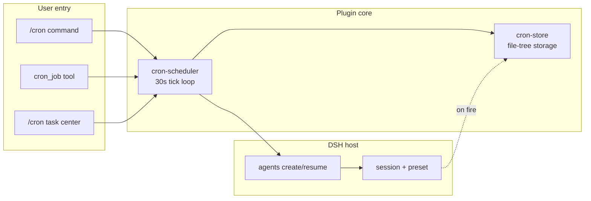

# dsh-cron-loop

English | [中文](./README.md)

A project-level cron scheduled-task plugin that brings "per-project-directory" scheduling to [DeepSeek Harness (DSH)](https://github.com/DeepSeekAI/deepseek-harness).

DSH's built-in `automation` is a global/session-level timer with no project binding and no cross-project task center. This plugin ships as a native cordis plugin (loaded via `dsh web --patch`) and adds three layers:

- **Project-level timers**: each job is bound to an absolute working directory (cwd); on fire it opens/resumes a DSH session in that directory and lets a full agent loop execute the injected prompt.
- **Claude Code-style command**: `/cron` inside a session manages the current project's tasks.
- **Task-center page**: `http://127.0.0.1:3080/cron` lists tasks and execution history across all local projects, with create/edit/pause/delete.



## Features

- 5-field cron expressions (min hour day-of-month month day-of-week); supports `*`, numbers, `,`, `-`, `*/n`, English aliases (`MON`/`JAN`…).
- Each job is bound to a fixed session: a random UUID is generated on first run, then `resume` reuses it; the session is visible and continuable in the DSH session list.
- Auto-rebuild on session archive; auto-heal on corrupt/seq-gap sessions.
- Per-job permission mode (`read-only` / `workspace-write` / `danger-full-access`), writing the full preset triple.
- Execution history is persisted; each job keeps the latest 50 runs with status and summary text.
- On restart, `running` records are marked `error`; the scheduler recomputes next-fire and does not replay backlog.

> Design and acceptance criteria: [specs/cron-loop.md](./specs/cron-loop.md).

## Installation

### Prerequisites

- Node.js ≥ 22
- pnpm ≥ 10 (`package.json` pins `pnpm@10.33.2`)
- DSH ≥ `0.1.2-rc.1` (`@deepseek-ai/dsh`), with `dsh web` able to start the Web server
- `~/.dsh/settings.yaml` has `agent-default-model` configured (jobs need a default model)

### Via run.sh (recommended)

The `run.sh` at the repo root manages release and installation. Three mutually exclusive modes:

```bash
# Dev mode: link source + restart dsh web (changes take effect immediately)
./run.sh dsh-cron-loop -d

# Deploy mode: install from .dist/ tarball + restart (version locked to snapshot)
./run.sh dsh-cron-loop -i               # install current version tarball
./run.sh dsh-cron-loop -r patch -i       # release + install tarball + restart

# Upgrade mode: update from .dist/ tarball + restart
./run.sh dsh-cron-loop -u               # upgrade to current version tarball
./run.sh dsh-cron-loop -r patch -u       # release + upgrade tarball + restart

# Release only (no install)
./run.sh dsh-cron-loop -r patch          # bump patch + pack + push
./run.sh dsh-cron-loop -r              # pack with current version (no bump)
./run.sh dsh-cron-loop -r minor -t       # release minor and create a git tag
```

### Manual install

1. **Install dependencies**

   ```bash
   cd dsh-cron-loop
   pnpm install
   ```

2. **Type-check (optional, validates the environment)**

   ```bash
   pnpm typecheck
   ```

3. **Install the plugin as a bundle into the web profile**

   ```bash
   dsh plugin --profile web add link:$(pwd)
   ```

   This creates a symlink dependency in `~/.dsh/profiles/web` pointing at this directory and registers `dsh-cron-loop` in `dsh.profile.bundles` automatically. Every subsequent `dsh web` boot loads the plugin - no `--patch` needed.

4. **Start**

   ```bash
   dsh web
   ```

   After startup, open `http://127.0.0.1:3080/cron` in a browser to see the task center.

> Note: the `name` entries in [cordis.patch.yml](./cordis.patch.yml) resolve relative to the file's own directory (`./plugins/...`), so they are machine-path-independent and need no manual editing.

## Usage

### Slash command (in-session)

Task ownership is determined by the current agent session's cwd (project directory):

```text
/cron <cron-expr> <task-prompt>   create a job (cwd = current project dir)
/cron list                        list this project's jobs
/cron rm <id>                     delete a job and its history
/cron on <id>                     resume (enable) a job
/cron off <id>                    pause (disable) a job
/cron                             show usage + current project job list
```

Example:

```text
/cron 0 9 * * 1-5 Summarize project status as a bullet list
/cron list
```

### Model tool `cron_job`

A single tool with multiple actions; the model can call it to CRUD jobs:

| action | description | required params |
|--------|-------------|-----------------|
| `add` | create a job | `prompt`; `cron` defaults to `* * * * *`; `cwd` defaults to current project dir |
| `list` | list all jobs | - |
| `update` | modify a job | `id` |
| `remove` | delete a job and its history | `id` |
| `pause` | disable a job | `id` |
| `resume` | enable a job | `id` |
| `runs` | view execution history (latest 10) | `id` |
| `clear_runs` | delete execution history | `id` (omit to clear all) |

### Web task center `http://127.0.0.1:3080/cron`

- **Project list view**: groups all jobs by cwd, showing task count, history count, and last-run time per project.
- **Project detail view**: after entering a project, switch between "Scheduled tasks" and "Recent history" tabs.
- Supports create/edit/pause/resume/delete; view each run's status, duration, and summary; one-click "Run now" for manual triggering.
- The session column in history is clickable to jump to the session and continue chatting.

### Permission modes

| Mode | sandbox | approval | Use case |
|------|---------|----------|----------|
| `read-only` | read-only | ask | view only (prompts for approval, **not unattended**) |
| `workspace-write` | workspace-write | ask | edit within workspace (prompts, **not unattended**) |
| `danger-full-access` | danger-full-access | never | **unattended recommended**, no approval prompt |

> `read-only` / `workspace-write` use `approval=ask`, which pops an approval dialog and stalls unattended jobs; only `danger-full-access` with `approval=never` suits true unattended runs.

## Data storage

Reads/writes a file tree directly (no storage-domain dependency), grouped by project directory name:

```text
~/.dsh/storages/crons/<project-basename>/
  ├── cron-1.json            # job record
  ├── run-cron-1-<ts>.json   # execution history (latest 50 per job)
  └── ...
```

- `<project-basename>` = basename of the cwd (e.g. `/Users/x/dsh-plugins` -> `dsh-plugins`).
- Writes go through atomic rename (temp file in same dir -> rename), so no half-written files.
- On startup, the whole tree is scanned into an in-memory cache; writes flush synchronously.

## Plugin structure

```text
dsh-cron-loop/
├── plugins/
│   ├── cron-store.ts          # file-tree storage (ctx.cronLoopStore service)
│   ├── cron-scheduler.ts      # 30s tick scheduler + cron_job model tool
│   ├── cron-commands.ts       # /cron slash command
│   ├── cron-web.ts            # /cron page + jobs/runs JSON API
│   ├── assets/cron.html       # task-center single-file frontend
│   └── lib/
│       ├── cron-core.ts       # cron parser pure functions (parseCron/matches/computeNextRun)
│       ├── cron-core.spec.ts  # cron-core smoke tests
│       └── agent-run.ts      # agent turn finalization + text extraction
├── specs/cron-loop.md         # design spec (SDD)
├── cordis.patch.yml           # DSH web profile overlay
├── package.json
└── tsconfig.json
```

## Known limitations

- No timezone parameter (system local timezone only), no second-level precision (tick granularity is 30s).
- No cross-process distributed lock: a single web process owns the scheduler; running this plugin in multiple processes may cause duplicate triggers.
- Catch-up strategy is latest-only: missing multiple fires replays only the latest; no replay while paused/disabled.
- Does not modify deepseek-harness itself; all capabilities go through public Services (`webServer`/`agents`/`commands`) + direct fs.
