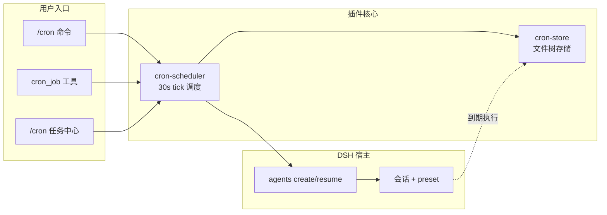

# dsh-cron-loop

[English](./README.en.md) | 中文

项目级 cron 定时任务插件，为 [DeepSeek Harness (DSH)](https://github.com/DeepSeekAI/deepseek-harness) 补齐「按项目目录归属」的定时任务能力。

DSH 内置的 `automation` 是全局/会话级定时器，不绑定具体项目目录，也没有跨项目的任务中心。本插件以 cordis 原生插件（`dsh web --patch` 加载）补齐三层能力：

- **项目级定时器**：每条任务绑定一个绝对工作目录（cwd），到期后在该目录新开/续接 DSH 会话，由完整 agent loop 执行注入的 prompt。
- **Claude Code 风格命令**：会话内 `/cron` 管理当前项目的定时任务。
- **任务中心页面**：`http://127.0.0.1:3080/cron` 查看本地所有项目的任务列表与执行历史，可新建/编辑/暂停/删除。



## 功能

- 5 段 cron 表达式（分 时 日 月 周），支持 `*`、数字、`,`、`-`、`*/n`、英文缩写（`MON`/`JAN`…）。
- 每个任务绑定固定会话：首次执行生成随机 UUID，之后每次 `resume` 复用，在 DSH 会话列表中可见可续聊。
- 会话归档自动重建、会话损坏（corrupt/seq-gap）自动自愈。
- 每任务可选权限模式（`read-only` / `workspace-write` / `danger-full-access`），写入完整 preset 三元组。
- 执行历史持久化，每任务保留最近 50 条，记录状态与摘要文本。
- 重启后 `running` 状态的记录标记为 `error`，调度从下次触发时间重算，不补积压。

> 设计与验收标准详见 [specs/cron-loop.md](./specs/cron-loop.md)。

## 安装

### 前置要求

- Node.js ≥ 22
- pnpm ≥ 10（`package.json` 已锁定 `pnpm@10.33.2`）
- DSH ≥ `0.1.2-rc.1`（`@deepseek-ai/dsh`），已安装并可用 `dsh web` 启动 Web 服务
- `~/.dsh/settings.yaml` 已配置 `agent-default-model`（任务执行需要默认模型）

### 用 run.sh（推荐）

仓库根目录的 `run.sh` 统一管理发布与安装。三种模式互斥：

```bash
# 开发模式：link 源码 + 重启 dsh web（改完代码即生效）
./run.sh dsh-cron-loop -d

# 部署模式：从 .dist/ tarball 安装 + 重启（版本锁定到打包快照）
./run.sh dsh-cron-loop -i               # 装当前版本 tarball
./run.sh dsh-cron-loop -r patch -i       # 发布 + 装 tarball + 重启

# 升级模式：从 .dist/ tarball 更新 + 重启
./run.sh dsh-cron-loop -u               # 升级到当前版本 tarball
./run.sh dsh-cron-loop -r patch -u       # 发布 + 升级 tarball + 重启

# 只发布（不安装）
./run.sh dsh-cron-loop -r patch          # bump patch + pack + push
./run.sh dsh-cron-loop -r               # 用当前版本打包（不 bump）
./run.sh dsh-cron-loop -r minor -t       # 发布 minor 并打 git tag
```

### 手动安装

1. **安装依赖**

   ```bash
   cd dsh-cron-loop
   pnpm install
   ```

2. **类型检查（可选，验证环境）**

   ```bash
   pnpm typecheck
   ```

3. **把插件作为 bundle 安装进 web profile**

   ```bash
   dsh plugin --profile web add link:$(pwd)
   ```

   这会在 `~/.dsh/profiles/web` 里建立指向本目录的软链依赖，并把 `dsh-cron-loop` 自动登记到 `dsh.profile.bundles`。之后每次 `dsh web` 启动都会自动加载本插件，无需再传 `--patch`。

4. **启动**

   ```bash
   dsh web
   ```

   启动后浏览器访问 `http://127.0.0.1:3080/cron` 即可看到任务中心。

> 说明：[cordis.patch.yml](./cordis.patch.yml) 中的 `name` 相对本文件所在目录解析（`./plugins/...`），与机器路径无关，无需手工修改。

## 使用

### 斜杠命令（会话内）

任务归属按当前 agent 会话的 cwd（项目目录）确定：

```text
/cron <cron表达式> <任务prompt>   新建任务（cwd = 当前项目目录）
/cron list                        列出当前项目的任务
/cron rm <id>                     删除任务及其历史
/cron on <id>                     恢复（启用）任务
/cron off <id>                    暂停（停用）任务
/cron                             显示用法 + 当前项目任务列表
```

示例：

```text
/cron 0 9 * * 1-5 总结项目状态并输出要点列表
/cron list
```

### 模型工具 `cron_job`

单工具多 action，模型可自主调用完成任务增删改查：

| action | 说明 | 必填参数 |
|--------|------|----------|
| `add` | 新建任务 | `prompt`；`cron` 缺省 `* * * * *`；`cwd` 缺省当前项目目录 |
| `list` | 列出全部任务 | — |
| `update` | 修改任务 | `id` |
| `remove` | 删除任务及历史 | `id` |
| `pause` | 停用任务 | `id` |
| `resume` | 启用任务 | `id` |
| `runs` | 查看执行历史（最近 10 条） | `id` |
| `clear_runs` | 删除执行历史 | `id`（不指定则清空全部） |

### Web 任务中心 `http://127.0.0.1:3080/cron`

- **项目列表视图**：按 cwd 分组展示所有项目的任务数、历史数、上次执行时间。
- **项目详情视图**：进入某个项目后，在「定时任务」与「最近执行历史」两个 tab 间切换。
- 支持新建/编辑/暂停/恢复/删除任务，查看每次执行的状态、耗时、摘要，并可一键「立即跑」手动触发。
- 执行历史的会话列可点击跳转到对应会话续聊。

### 权限模式说明

| 模式 | sandbox | approval | 适用场景 |
|------|---------|----------|----------|
| `read-only` | read-only | ask | 仅查看（会弹审批，**不适合无人值守**） |
| `workspace-write` | workspace-write | ask | 工作区内修改（会弹审批，**不适合无人值守**） |
| `danger-full-access` | danger-full-access | never | **无人值守推荐**，不弹审批 |

> `read-only` / `workspace-write` 的 `approval=ask` 会弹审批弹窗，无人值守时任务会卡住；仅 `danger-full-access` 的 `approval=never` 适合真正无人值守。

## 数据存储

直接读写文件树（不依赖 storage-domain），按项目目录名分组：

```text
~/.dsh/storages/crons/<project-basename>/
  ├── cron-1.json            # 任务记录
  ├── run-cron-1-<ts>.json   # 执行历史（每任务保留最近 50 条）
  └── ...
```

- `<project-basename>` = cwd 路径的 basename（如 `/Users/x/dsh-plugins` → `dsh-plugins`）。
- 写操作走原子 rename（同目录临时文件 → rename），保证不写半截文件。
- 启动时全量扫描加载到内存缓存，写操作同步刷盘。

## 插件结构

```text
dsh-cron-loop/
├── plugins/
│   ├── cron-store.ts          # 文件树存储（ctx.cronLoopStore 服务）
│   ├── cron-scheduler.ts      # 30s tick 调度 + cron_job 模型工具
│   ├── cron-commands.ts       # /cron 斜杠命令
│   ├── cron-web.ts            # /cron 页面 + jobs/runs JSON API
│   ├── assets/cron.html       # 任务中心单文件前端
│   └── lib/
│       ├── cron-core.ts       # cron 解析纯函数（parseCron/matches/computeNextRun）
│       ├── cron-core.spec.ts  # cron-core 冒烟测试
│       └── agent-run.ts       # agent 回合收口 + 最终文本提取
├── specs/cron-loop.md         # 设计 spec（SDD）
├── cordis.patch.yml           # DSH web profile 叠加层
├── package.json
└── tsconfig.json
```

## 已知限制

- 不做时区参数（一律系统本地时区）、秒级精度（tick 粒度 30s）。
- 不做跨进程分布式锁：单 web 进程持有调度器，多进程同时跑本插件可能重复触发。
- catch-up 策略为 latest-only：错过多次只补跑最新一次，停用/暂停期间不补跑。
- 不修改 deepseek-harness 本体，全部能力走公开 Service（`webServer`/`agents`/`commands`）+ 直接 fs。
