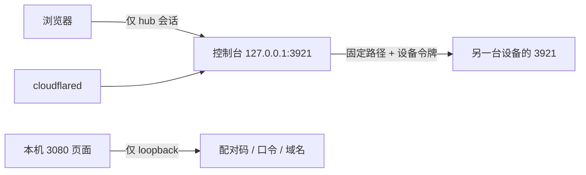
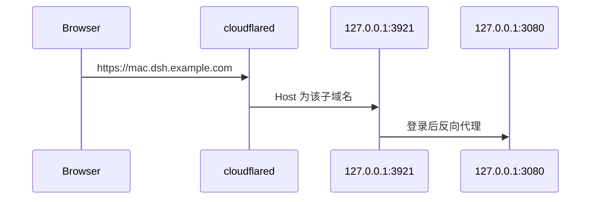

# 远程接入

## 目标

在每台 DSH 上提供一个可经 Cloudflare Tunnel 访问的入口。登录后使用的是这台电脑自己的 DSH 界面，不是一个只能发一句话的壳。公网不能直接打到 3080。

一台设备一个子域名。打开 `https://mac.dsh.example.com` 就是那台电脑的 DSH，不用 `/home` 或 `/inc`，也不区分中枢和出站连接。

## 范围

- 插件名 `dsh-remote-access`。本机页面在 `http://127.0.0.1:3080/dsh-remote-access`。
- 控制面另听 `127.0.0.1` 上的独立端口（默认 3921）。cloudflared 只指向这个端口。
- 每台电脑在本机页面添加自己的子域名和访问口令，再安装并连接隧道。访问入口就是这个子域名。
- 公网 Host 在登录之后，控制面把其余请求和 `/api/remote.mux` 反向代理到 `127.0.0.1:3080`。上游 Host 和 Origin 都固定成 `127.0.0.1:3080`，浏览器带来的公网 Origin 不能转发，否则本机界面会拒绝工作区和会话接口。启动 token 只在进程内交换，不发给浏览器。
- 未登录的公网请求不到 3080，页面只显示登录，不渲染设备列表。
- 窄屏打开已登录界面时，插件在返回的 HTML 里注入一段脚本。收起后的侧边栏轨隐藏，原来的入口不再显示。悬浮按钮一点，把现有侧边栏浮在主容器上，但不能拿出页面根节点，否则工作区和会话点不了；再点按钮或遮罩就收回去。脚本只认 `data-sidebar-collapsed` 和「打开侧边栏 / 收起侧边栏」。

## 信任边界

- 判定本机管理：TCP 对端是 loopback，且 `Host` 是 `127.0.0.1` 或 `localhost`。cloudflared 虽从本机连入，但 `Host` 是公网域名，不算本机管理。
- 公网请求的 TCP 对端也必须是 loopback，且 `Host` 必须等于已配置的 `publicOrigin` 主机名，否则 404。未配置公网源时，公网请求一律 404。

- 不监听 `0.0.0.0`。不把 3080 当作隧道目标；插件无法关掉 DSH 自己的页面，隧道打到 3080 会暴露整个图形界面。

## 配对与切换

1. 在设备本机页面生成一次性配对码（32 字节，5 分钟，用后即废）。公网不能生成配对码。
2. 控制台提交 `https://<设备主机>` 和配对码。主机名必须落在已配置的域名后缀下，且为 https、无用户信息、无端口、无路径。
3. 控制台只请求该源的 `POST /api/pair`。成功后设备令牌只返回这一次；控制台加密落盘，浏览器拿不到令牌。
4. 控制台可以同时留下多台设备。不同公网源各占一条；同一公网源再次配对只刷新那一条。切换只改当前发送目标，不解除其他绑定。
5. 一台设备最多保留 8 个控制台令牌。新配对追加，不使其他控制台失效。超过 8 个时丢掉最早的。
6. 切换只接受已绑定列表里的 id，或固定的 `this`（本机，进程内调用，不走网络）。

## 接口

| 路径 | 谁可以调 | 作用 |
|------|----------|------|
| `POST /api/pair` | 持有未过期配对码 | 换取设备令牌，只返回一次 |
| `GET /api/v1/status` | 设备令牌 | 名称与运行时长 |
| `GET /api/v1/sessions` | 设备令牌 | 本机会话 id / cwd / 是否在运行 |
| `POST /api/v1/prompt` | 设备令牌 | `{ sessionId, text }`，sessionId 必须是本机已有会话 |
| `POST /api/hub/login` | 公网 Host | 用本机设置的口令换 hub 会话 |
| `POST /dsh-remote-access/api/hub/pairing` | 仅本机管理 | 生成配对码 |
| `POST /dsh-remote-access/api/hub/passphrase` | 仅本机管理 | 设置控制台口令 |
| `POST /dsh-remote-access/api/hub/settings` | 仅本机管理 | 公网源、域名后缀、端口、设备名 |
| `GET/POST /api/hub/devices` | hub 会话或本机管理 | 列出或绑定设备 |
| `POST /api/hub/active` | hub 会话或本机管理 | 切换当前设备 |
| `POST /api/hub/paths` | 仅本机管理 | 登记路径槽并签发一次性接入码 |
| `GET /api/hub/paths` | hub 会话或本机管理 | 路径槽与是否在线，不含令牌 |
| `DELETE /api/hub/paths/<slug>` | 仅本机管理 | 删除路径槽 |
| `POST /api/relay/enroll` | 公网 Host + 未过期接入码 | 换取中继令牌，只返回一次 |
| `POST /api/relay/poll` | 中继令牌 | 取一条待执行动作；令牌决定 slug，调用方不能自报 |
| `POST /api/relay/result` | 中继令牌 | 交回该 slug 自己领走的那一条结果 |
| `GET/POST /api/hub/route/<slug>/…` | hub 会话 | `status` / `sessions` / `prompt`；`selfSlug` 走本机，其余走中继 |
| `POST /api/hub/spoke` | 仅本机管理 | 用接入码连上别人的中枢，令牌加密落盘后开始出站轮询 |
| `GET /api/hub/tunnel` | 仅本机管理 | 通道是否已安装、已授权、已配置、在跑、已连接 |
| `POST /api/hub/tunnel/setup` | 仅本机管理 | 安装 cloudflared、打开授权、写入指向 3921 的配置 |
| `POST /api/hub/tunnel/start` | 仅本机管理 | 启动本插件的隧道 |
| `POST /api/hub/tunnel/stop` | 仅本机管理 | 暂停本插件的隧道 |

浏览器使用 `Authorization: Bearer`，不用 Cookie。设备令牌与 hub 会话分开。

## 安全验收

- 错误 Host、未登录、错误令牌、过期或重复配对码均失败，响应不包含令牌、配对码或口令。
- 绑定前拒绝 http、IP、localhost、用户信息、非后缀主机名，以及解析到 loopback / 私网 / 链路本地的地址。
- 出站只允许四个固定路径，不跟随重定向，不关闭 TLS 校验。
- 状态文件权限 `0600`。日志和接口不打印密钥。
- 配对与登录有进程内次数限制。提示文本有长度上限。
- 路径名只允许小写字母开头的短名，拒绝 `api` 等保留名。接入码一次性。中继令牌对不上 slug 不能 poll/result。未登录不能走 `/route`。对方没在轮询时返回明确离线，不改去打它的内网地址。

## 边界

- 插件进程不保存 Cloudflare API 令牌。隧道启停只在本机管理页，公网接口不提供。
- 本机页检测 cloudflared、登录证书、配置和进程。已连接才能显示「已连接」。暂停只结束使用本插件配置文件的 cloudflared，不杀其他隧道。
- 家里这台可手动运行 `scripts/setup-tunnel.sh`。凭证和 `config.yml` 只放在 `~/.dsh/storages/cloudflared`，目录 `0700`、文件 `0600`。ingress 只能指向 `127.0.0.1` 的控制端口，拒绝 3080。
- 会话不在查询结果里就不能 resume，也不能按调用方给的 cwd 新建会话。
- 宿主没有 `agents` 或 `sessionQuery` 时，对应动作返回明确错误，不改走 shell。
