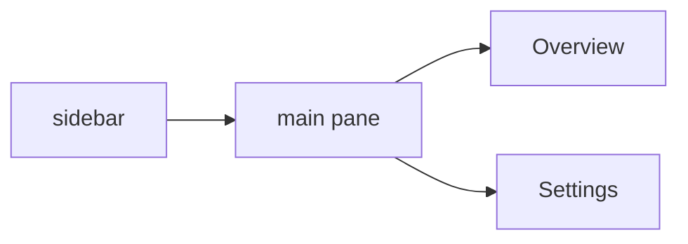

# __PLUGIN_NAME__

English | [中文](./README.md)

DSH plugin scaffold. The page is `http://127.0.0.1:3080/__PLUGIN_NAME__`, with a sidebar and a main pane (React, Tailwind, Radix / shadcn).



## Usage

From the repo root:

```bash
./run.sh __PLUGIN_NAME__ -d -r
```

Release and install match the other plugins. See the [repo README](../README.en.md).

After editing `web/src`, run `pnpm run build` in this directory and refresh. Restart dsh web after editing `plugins/web.ts`.

Spec: [docs/specs/overview.md](./docs/specs/overview.md).
