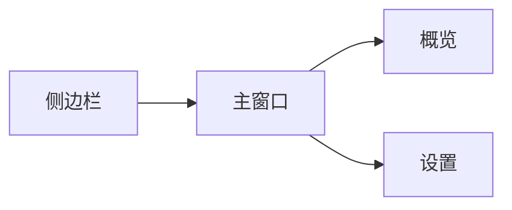

# __PLUGIN_NAME__

[English](./README.en.md) | 中文

DSH 插件脚手架。页面在 `http://127.0.0.1:3080/__PLUGIN_NAME__`，默认是侧边栏 + 主窗口（React、Tailwind、Radix / shadcn）。



## 使用

在仓库根目录：

```bash
./run.sh __PLUGIN_NAME__ -d -r
```

发布与安装与其他插件相同，见 [仓库 README](../README.md)。

改 `web/src` 后在本目录执行 `pnpm run build`，刷新即可。改 `plugins/web.ts` 后需要重启 dsh web。

设计与验收见 [docs/specs/overview.md](./docs/specs/overview.md)。
